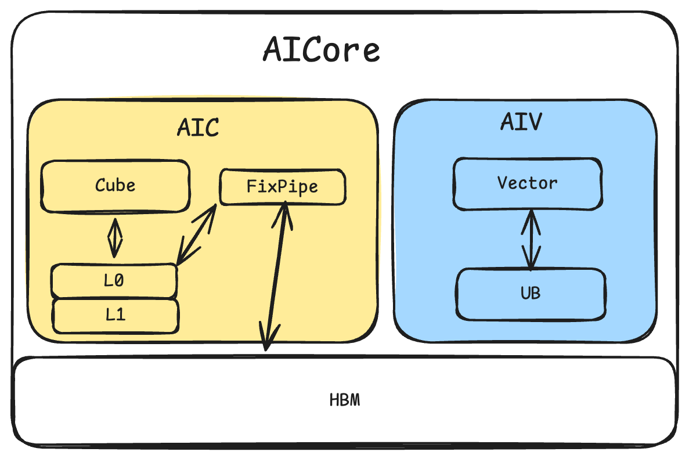

# Cube与Vector优化

## 硬件背景

本文档从宏观角度介绍AscendNPU IR中Cube-Vector（CV）优化的整体流程。CV优化面向Atlas A2系列产品、Atlas A3系列产品的NPU硬件，针对Cube（矩阵乘单元）和Vector（向量运算单元）两类核心的协同工作，在HIVM（华为中间表示虚拟机）层进行一系列变换，以提升混合内核（Mix Kernel）的执行效率。

### 术语与背景知识（阅读前必读）

以下术语在CV文档中反复出现，建议先建立基本概念后再阅读各pass细节。

| 术语 | 含义 | 补充说明 |
|------|------|----------|
| **HIVM** | Huawei Intermediate Virtual Machine，华为中间表示虚拟机 | AscendNPU IR中的一种dialect，承载面向NPU的算子（如mmadL1、fixpipe、vadd）与控制流。 |
| **IR** | Intermediate Representation，中间表示 | 编译器在源码与机器码之间的抽象表示。本仓库使用MLIR（Multi-Level IR），IR以SSA形式组织。 |
| **Bufferization** | 将tensor抽象转换为具体内存（memref）的过程 | 在「预bufferization」阶段，IR仍以tensor为主（逻辑多维数组）；bufferization之后会引入memref（带地址/布局的内存引用）。CV中多数pass在预bufferization阶段运行，因此文档中常见「tensor.empty」「tensor的slice」等表述。 |
| **tensor vs memref** | tensor：逻辑多维数组，无显式地址；memref：有基址、步长、形状的内存区域 | 在CV流程中，fixpipe的「输出」常先以tensor表示，后续通过workspace（memref）或bufferization落到具体内存。 |
| **Workspace** | 运行时在GM上分配的一块连续内存，作为kernel参数传入 | 用于存放Cube-Vector之间的中间结果（如fixpipe输出）。多个中间buffer可在同一块workspace上按偏移分配，由PlanMemory计算偏移，从而复用一块大buffer，减少总占用。 |
| **Liveness** | 某个buffer从「被定义/首次使用」到「最后一次使用」的生命周期 | PlanMemory根据liveness判断两个buffer是否可能同时存活；若不重叠，可分配相同基址、不同偏移，实现复用。 |
| **Inplace** | 操作的输出直接写在输入的存储位置上，复用同一块buffer | 例如vcast从f16转到i16（等宽），输出可覆盖输入，减少alloc。PlanMemory会识别可inplace的op并做相应偏移分配。 |
| **AIC / AIV** | AIC：以Cube为主的子内核；AIV：以Vector为主的子内核 | Mix内核拆分后，AIC主要在Cube核心执行，AIV主要在Vector核心执行；二者通过fixpipe、DMA等传递数据，由Host或调度器协调调用顺序。 |
| **Host / Device** | Host：在CPU上运行<br>Device：在NPU上运行 | Mix内核属于device侧<br>文档中「Mix只能被Host调用」指：从Host发起的kernel调用里，可以调用mix entry，而device上的另一个kernel不能直接call一个mix函数（当前约定）。 |
| **CC / CV / VC / VV** | 两个字母分别表示「前一段计算单元」和「后一段计算单元」：C=Cube，V=Vector | 例如CV表示Cube算完经fixpipe/load后接Vector运算；<br>CC表示两段Cube之间通过fixpipe+load衔接。用于描述InsertWorkSpaceForMixCV的匹配模式。 |

**关于「预bufferization」与「后bufferization」**：

CV相关pass多数在预bufferization阶段（`hivmPreBufferizationOptimizationPipeline`）执行，此时IR仍是tensor为主、带`scf.for`等控制流。Bufferization会把tensor转为memref并决定物理布局；在此之后还有后bufferization阶段的优化（如另一轮PlanMemory针对`memref.alloc`）。理解「先做CV结构变换，再做内存具体化」有助于理解pass顺序。

### 芯片架构

Ascend NPU采用异构计算架构，主要包含：

| 组件 | 说明 | 典型规格（举例） |
|------|------|-------------------|
| **Cube** | 矩阵乘单元，执行`mmadL1`、`batchMmadL1`等矩阵运算 | 24个AI Core |
| **Vector** | 向量运算单元，执行`vadd`、`vcast`、`vreduce`等向量运算 | 48个AI Core |
| **L0C** | Cube输出缓冲，存放矩阵乘结果 | 128KB |
| **L0A/L0B** | Cube输入缓冲 | 64KB |
| **UB** | 统一缓冲，Vector运算主存 | 256 KB |
| **GM** | 全局内存 | 外部DDR |

fixpipe是Cube与Vector之间的数据搬运通道，昇腾芯片的Cube和Vector底层架构是分离的。对于不同版本的芯片来说，存在不同的交互通路。例如对于910系列来说，Cube计算完成后，通过fixpipe将结果从L0C搬运到GM，供后续Vector运算使用。在IR中体现为`hivm.hir.fixpipe`算子；硬件上对应专门的L0C→UB数据通路，可同时完成类型转换、量化等（由fixpipe的`pre_quant`、`pre_relu`等属性控制）。910系列的芯片架构如下：


## 算法原理

### createNormalizeMatmulPass

- **作用**：规范化`hivm.hir.mmadL1`、`hivm.hir.batchMmadL1`的M/K/N维度、init条件及per-channel add形式。
- **目的**：统一matmul的IR形态，便于后续fixpipe插入、tiling等pass匹配与变换。
- **典型变换**：将vbrc + vadd形式的bias内联进mmadL1的init；提取真实M/K/N并替换常量；处理PerChannel场景。
- **典型场景**：`elementwise`累加。

变换前：

```mlir
%2 = ops // not 0 const
%3 = hivm.hir.mmadL1 ins(*)
       outs(%2 : tensor<16x32xf32>) -> tensor<16x32xf32>
```

变换后：

```mlir
%2 = ops
%3 = tensor.empty() : tensor<16x32xf32>
%4 = hivm.hir.mmadL1 ins(*)
        outs(%3 : tensor<16x32xf32>) -> tensor<16x32xf32>
%5 = hivm.hir.vadd ins(%2, %4: tensor<1x32xf32>) outs(%2 : tensor<16x32xf32>)
```

### createInlineFixpipePass

- **作用**：在mmadL1/batchMmadL1与store之间插入`hivm.hir.fixpipe`，将store+vcast等合并进fixpipe的量化/激活选项。
- **目的**：显式表达Cube到Vector的数据搬运，使后续workspace分配、load/store插入有明确插入点。
- **典型变换**：在mmadL1结果到store的use链上插入fixpipe；将vcast(f32->f16) 等融合为fixpipe的`pre_quant = F322F16`。
- **典型场景**：纯Cube到Store。

变换前：

```mlir
mmadL1 -> store
```

变换后：

```mlir
mmadL1 -> fixpipe
```

InlineFixpipe负责插入fixpipe，站在新增的fixpipe的基础上，尝试inline op，如`hivm.vcast`/`hivm.vrelu`/`hivm.store`。

### createTileBatchMMIntoLoopPass

- **作用**：将`hivm.hir.batchMmadL1`沿batch维度展开为`scf.for`循环，每次迭代执行单次`mmadL1`和fixpipe。
- **目的**：将batch维拆成循环，使load/fixpipe/store等可以按batch索引访问，便于workspace管理和流水。
- **典型变换**：TileBatchMMIntoLoop将batchMmadL1展开为循环。

变换前：

```mlir
batchmmadL1 a : [batch, m, k], b[batch, k, n]
fixpipe workspace : [batch, m, n]
```

变换后：

```mlir
for batch_idx in range(batch):
  mmadL1(extract_slice(a), extract_slice(b))
  fixpipe(extract_slice(workspace))
```

### createInsertLoadStoreForMixCVPass

- **作用**：在Cube-Vector交汇处插入`load`/`store`，使数据在tensor与全局workspace间正确流转。
- **目的**：保证CV之间数据的正确传递。
- **典型变换**：batchMmadL1 + fixpipe被改写为循环内的mmadL1 + fixpipe，对输入/输出做extract_slice / insert_slice。
- **典型场景**：Cube-Vector混合（CV模式）。

变换前：

```mlir
mmadL1
fixpipe
vadd
```

变换后：

```mlir
mmadL1
fixpipe
load
vadd
```

### createInsertWorkSpaceForMixCVPass

- **作用**：在Cube-Vector交汇点（CC/CV/VC/VV）用`memref_ext.alloc_workspace`替换`tensor.empty`。
- **目的**：将fixpipe输出、store输出等中间buffer改为从全局workspace分配，实现跨迭代、跨核共享。
- **匹配模式**：CC（`mmadL1`→`fixpipe`→`load`→`mmadL1`）、CV（`mmadL1`→`fixpipe`→`load`→`vector`）、VC（`vector`→`store`→`load`→`mmadL1`）、VV（`vector`→`store`→`load`→`vector`）。
- **典型场景**：Cube-Vector混合（CV模式）。

变换前：

```mlir
%1 = mmadL1
%2 = tensor.empty() 
%3 = fixpipe ins(%1) outs(%2)
%4 = load ins(%3)
vadd (%4)
```

变换后：

```mlir
%1 = mmadL1
%2 = memref_ext.alloc_workspace()
%3 =  bufferization.to_tensor(%2)
%4 = fixpipe ins(%1) outs(%3)
%5 = load ins(%4)
vadd (%5)
```

### createBindWorkSpaceArgPass

- **作用**：将函数内的`memref_ext.alloc_workspace`绑定到函数的workspace参数（`hacc.arg_type = #hacc.arg_type<workspace>`）。
- **目的**：统一workspace来源，使运行时通过参数传入workspace指针，实现多kernel共享一块workspace。
- **前置条件**：函数需有workspace参数；`InsertWorkSpaceForMixCV`已插入`alloc_workspace`。
- **典型场景**：Cube-Vector混合（CV模式）。

变换前：

```mlir
func.func @bind_workspace_arg(
              %arg0: i64 {hacc.arg_type = #hacc.arg_type<ffts_base_address>},
              %arg1: memref<?xi8> {hacc.arg_type = #hacc.arg_type<workspace>}){
  memref_ext.alloc_workspace() : memref<100xi32>
  return
}
```

变换后：

```mlir
func.func @bind_workspace_arg(
              %arg0: i64 {hacc.arg_type = #hacc.arg_type<ffts_base_address>},
              %arg1: memref<?xi8> {hacc.arg_type = #hacc.arg_type<workspace>}){
  memref_ext.alloc_workspace() from %arg1 : memref<100xi32>
  return
}
```

### createPlanMemoryPass

- **作用**：在`GLOBAL_WORKSPACE_PLAN`模式下，对`memref_ext.alloc_workspace`进行内存规划，将alloc替换为`hivm.hir.pointer_cast` + 偏移。
- **目的**：在给定workspace基址上，按liveness与inplace规则分配偏移，最大化复用、减少总workspace大小。
- **典型变换**：多个alloc_workspace被映射到同一块workspace的不同偏移；冲突的buffer分配不同偏移。

变换前：

```mlir
func.func @bind_workspace_arg(
              %arg0: i64 {hacc.arg_type = #hacc.arg_type<ffts_base_address>},
              %arg1: memref<?xi8> {hacc.arg_type = #hacc.arg_type<workspace>}){
  memref_ext.alloc_workspace() from %arg1 : memref<100xi32>
  return
}
```

变换后：

```mlir
func.func @bind_workspace_arg(
              %arg0: i64 {hacc.arg_type = #hacc.arg_type<ffts_base_address>},
              %arg1: memref<?xi8> {hacc.arg_type = #hacc.arg_type<workspace>}){
  memref_ext.alloc_workspace() from %arg1 offset=[0] : memref<100xi32>
  return
}
```

### createSplitMixKernelPass

- **作用**：将Mix内核拆分为AIC（Cube主）和AIV（Vector主）两个子函数，并生成mix entry。
- **目的**：后端可按AIC/AIV分别调度到Cube/Vector核心，便于流水与同步。
- **典型变换**：根据core type遍历IR，将Cube相关代码放入AIC，Vector放入AIV；用`annotation.mark`标记跨核传递的tensor。

变换前：

```mlir
func.func @bind_workspace_arg(
              %arg0: i64 {hacc.arg_type = #hacc.arg_type<ffts_base_address>},
              %arg1: memref<?xi8> {hacc.arg_type = #hacc.arg_type<workspace>},
     hivm.func_core_type = #hivm.func_core_type<MIX>){
  mmadl1
  memref_ext.alloc_workspace() from %arg1 offset=[0] : memref<100xi32>
  fixpipe
  load
  vadd
}
```

变换后：

```mlir
func.func @bind_workspace_arg_aic(
              %arg0: i64 {hacc.arg_type = #hacc.arg_type<ffts_base_address>},
              %arg1: memref<?xi8> {hacc.arg_type = #hacc.arg_type<workspace>},
     hivm.func_core_type = #hivm.func_core_type<AIC>){
  mmadl1
  memref_ext.alloc_workspace() from %arg1 offset=[0] : memref<100xi32>
  fixpipe
}
func.func @bind_workspace_arg_aiv(
              %arg0: i64 {hacc.arg_type = #hacc.arg_type<ffts_base_address>},
              %arg1: memref<?xi8> {hacc.arg_type = #hacc.arg_type<workspace>},
     hivm.func_core_type = #hivm.func_core_type<AIV>){
  load
  vadd
}
```

## 本地调试与测试方法

**单个Pass调试命令**：

```bash
bishengir-opt -hivm-normalize-matmul input.mlir -o output.mlir
bishengir-opt -hivm-inline-fixpipe input.mlir -o output.mlir
bishengir-opt --hivm-tile-batchmm-into-loop input.mlir -o output.mlir
bishengir-opt -insert-workspace-for-mix-cv input.mlir -o output.mlir
bishengir-opt --hivm-bind-workspace-arg input.mlir -o output.mlir
bishengir-opt -hivm-plan-memory -mem-plan-mode=global-work-space-plan input.mlir -o output.mlir
# 需要时显式运行独立的 split-mixed-if；TCB mark/hoist 仅 Ascend950。
bishengir-opt -hivm-split-mixed-if-conditionals -hivm-mark-tightly-coupled-buffer \
  -hivm-hoist-tightly-coupled-alloc -hivm-split-mix-kernel input.mlir -o output.mlir
```

**测试用例存放路径**：

目前库上所有的测试用例所在的路径都在`path-to-ascendnpuir/bishengir/test`下，需要运行某个pass，搜索对应的编译命令即可找到对应的测试文件，例如搜索`hivm-normalize-matmul`即可找到对应的测试文件`bishengir/test/Dialect/HIVM/normalize-matmul.mlir`。

**测试执行方式**：

具体的运行命令在每个测试文件的最上面。例如：

```bash
// RUN: bishengir-opt -hivm-normalize-matmul %s -split-input-file -verify-diagnostics -allow-unregistered-dialect | FileCheck %s
```

其中，`bishengir-opt`和`FileCheck`均为编译生成的二进制可执行文件，路径在`path-to-ascendnpuir/build/bin`下。上述命令中的`%s`替换成对应的测试文件`bishengir/test/Dialect/HIVM/normalize-matmul.mlir`。

输出的`mlir`会匹配测试文件中的`CHECK:`部分，测试后没有任何`CHECK failed`的报错即执行成功。

## 约束能力

- `createPlanMemoryPass`处理数据交互处的空间大小，因为会动态返回数据所需的总空间大小，因此对大小没有限制。
- `createInlineFixpipePass`目前只能inline `vcast`/`relu`/`store`三类op。
