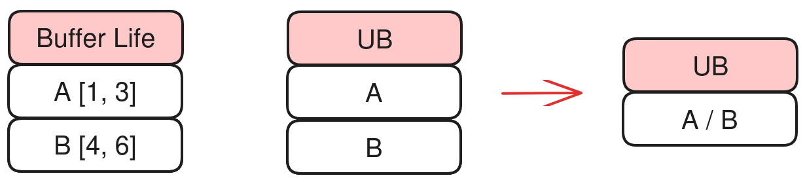

# 内存管理

本文介绍HIVM中的PlanMemory变换（PlanMemoryPass），包括硬件背景、算法原理、接口说明和使用约束。

## 硬件背景

昇腾硬件片上内存使用Buffer机制，主要包含Cube（矩阵）计算单元和Vector（矢量）计算单元所涉及的存储单元。软件需要显式控制内存地址，并确保操作地址的对齐。

以Atlas A2训练系列产品 / Atlas A2推理系列产品为例，硬件架构图如下：


各类Buffer的对齐要求与功能如下：

| Buffer | 对齐要求 | 功能 |
|-----|-----|-----|
| Unified Buffer (UB) | 32字节对齐 | 通用缓存空间，主要用于向量和标量运算 |
| L1 Buffer | 32字节对齐 | 暂存feature map等卷积使用到的数据 |
| L0A Buffer | 512字节对齐 | 暂存矩阵运算的左矩阵（feature map） |
| L0B Buffer | 512字节对齐 | 暂存矩阵运算的右矩阵（weight） |
| L0C Buffer | 512字节对齐 | 暂存矩阵运算的中间结果和输出矩阵 |
| BT Buffer | 64字节对齐 | BiasTable Buffer，存放矩阵运算中的Bias |
| FP Buffer | 64字节对齐 | Fixpipe Buffer，存放量化参数、Relu参数等 |

## 算法原理

### 软件背景

针对昇腾片上内存，输入IR中`memref.alloc`的Buffer仅包含变量名称、所需内存空间大小，不包含地址信息。因此AscendNPU IR内存管理模块（PlanMemory）需要根据Buffer的生命区间分配合适的内存地址，避免运算过程中出现内存覆写，引发计算精度问题。

为了在有限的内存空间内分配完所有的Buffer，PlanMemory会基于IR语义和硬件约束进行内存复用。同时为了避免不必要的数据依赖影响性能，PlanMemory提供了三级分配内存算法，在尽量保障性能的前提下提升内存利用率。

片上内存分配覆盖Cube与Vector两类计算单元对应的存储资源（包括UB、L1、L0C等）：

- Cube单元相关存储：L0A存储左矩阵、L0B存储右矩阵，二者数据均从L1 Buffer搬入；L0C存储矩阵乘的结果与中间结果。内存分配主要在L1与L0C空间进行。
- Vector单元相关存储：UB（Unified Buffer）存储向量计算的输入与输出，内存分配需要在UB空间为各Buffer分配内存。

除了片上内存外，PlanMemory还会分配少量Workspace内存（`memref_ext.alloc_workspace`)，主要用于CV场景。若Cube计算完成后需要由Vector单元继续参与运算，需先将Cube运算结果从L0C搬出，临时保存在Workspace空间，再搬入UB进行Vector运算。片外空间交给框架Runtime统一申请管理，因此算子需要反馈所需的Workspace空间大小。

### 相关术语说明

- **BufferLife**：Buffer的生命区间，指单个Buffer从首次被写入（生成点gen）到最后一次被读取（销毁点kill）的执行区间。若两个Buffer的生命区间无重叠，则它们可以共用同一块内存。PlanMemory基于生命区间计算每个`alloc` Buffer的地址偏移，实现非重叠Buffer的内存共享。
- **Alias（别名）**：当两个数据本质来源于同一个数据的时候，则二者为别名关系，例如执行`subview`前后的数据。
- **Inplace复用**：某op的输出可以写在输入的存储位置上（覆盖写入），从而减少一次alloc。例如`vcast`从`f16`转到`i16`（等宽），其输出可复用输入Buffer。PlanMemory会识别这类op，为输出分配与输入相同的地址偏移（或满足硬件inplace约束的规则）。
- **地址偏移/ pointer_cast**：内存分配后，不再生成独立`alloc`，而是生成`hivm.hir.pointer_cast(offset)`，其中`offset`为该Buffer在对应内存空间中的字节偏移量。

### 核心流程总览

源文件路径：`bishengir/lib/Dialect/HIVM/Transforms/PlanMemory.cpp`

主流程包含：

1. 生命区间分析：对IR中的每个Buffer进行gen和kill的分析；
2. 内存分配：基于上述生命区间的分析，为各Buffer分配内存地址；
3. OP变换：使用`hivm.hir.pointer_cast(offset)`替换原`alloc`，将分配得到的内存起始地址写回到对应的Buffer。

#### 生命区间分析

生命区间分析的主要执行流程如下：

1. 通过社区`Liveness`类分析各个节点的活跃性。
2. 遍历IR（包含`scf.for`、`scf.if`、`scf.while`），收集每个op的gen（生成的Buffer）与kill（最后一次读取的Buffer）信息，用于计算每个Buffer的生命区间。
3. 根据gen与kill计算每个Buffer的生命周期，即首次写入到最后一次读取的区间。如果两个Buffer的生命周期不重叠，即可共享内存。
4. 基于Alias关系，识别可执行inplace复用的Buffer，为其分配相同的内存起始地址。

#### 内存分配模式

内存分配包含两种模式：顺序分配和可复用分配。当所有Buffer内存占用之和能够容纳在对应的Memory Scope（内存空间，如UB、L1等）范围内时，采用简单的顺序分配即可。当总占用超出对应内存空间大小时，需通过算法分析可复用内存的Buffer，在保证无内存冲突、不影响计算精度的前提下完成内存复用。

可复用分配包括Inplace复用与三级分配复用两类。

**Inplace复用**：

满足以下全部条件时，可执行Inplace复用：

- 属于同一Memory Scope，例如均为UB空间。
- 满足依赖关系：例如`A = B + C`场景下，A的kill节点是C的gen节点。
- 符合硬件层面的约束要求。

**三级分配复用**：

三级分配策略按优先级从高到低依次尝试，高优先级分配失败时自动降级回滚并重试。

- **Level 2：同流水优先复用策略**

  昇腾硬件采用多流水单元架构，PIPE并行起来是关键。不同流水间的内存复用会引入额外数据依赖，造成流水冲突，降低流水执行效率。

  Level2策略优先在同类型流水内部进行内存复用，会使非DMA的相同流水优先复用（例如Vector指令的Buffer优先与其他Vector指令的Buffer复用）。

  举例：

  ```text
  Shared A [A0, A1]
  Shared B [B]
  Shared C [C]
  Shared D [D0, D1]
  Loop i:
    // sync
    op1(A0, A1) // DMA OP, Double Buffer
    op2(B)      // Vector OP
    op3(C)      // Vector OP
    op4(D0, D1) // DMA OP, Double Buffer
  ```

  开启Double Buffer后，A/D为DMA PIPE涉及的内存，各自申请了2片内存。当共享内存资源有限时，若让C与A复用内存，会在`op1`(DMA PIPE) 和`op4` (Vector PIPE) 之间引入额外依赖，导致`MTE_PIPE`与`V_PIPE`无法并行计算，影响流水性能。

  采用Level2的内存分配策略后，C与B复用内存，两者同为Vector指令，而`V_PIPE`本就只能串行执行，因此Vector指令之间复用不会对流水效率造成额外影响。

  Level2策略的流水效果对比：
  

    - 优势：同流水内的复用不会引入PIPE间额外依赖，整体算子性能更优。
    - 劣势：可复用的解空间小，内存复用成功的概率相对更低。

- **Level 1：Double Buffer保护策略**

  DoubleBuffer通过并行化数据加载与计算，大幅提升计算性能、减少等待时间，是算子性能优化的核心手段。复杂场景下内存资源紧张时，若Single Buffer复用了Double Buffer，会导致Double Buffer无法并行，算子流水被打断，造成算子性能下降。

  Level1策略规定：同一循环内，如果SingleBuffer复用DoubleBuffer，则SingleBuffer自动转DoubleBuffer。

  举例：

  ```text
  Shared A [A0, A1]
  Shared B [B]
  Shared C [C]
  Shared D [D0, D1]
  Loop i:
    // sync
    op1(A0, A1) // DMA OP, Double Buffer
    op2(B)      // Vector OP
    op3(C)      // Vector OP
    op4(D0, D1) // DMA OP, Double Buffer
  ```

  开启Double Buffer后，A/D为DMA PIPE涉及的内存，各自申请了两片内存空间。当共享内存资源有限时，C的Single Buffer与A的一个Buffer复用，会导致`op1`使用A0内存时，必须等待`op3`释放C(A0) 内存，因此会导致流水打断，最终降低算子性能。

  采用Level1策略后，C复用Double Buffer空间时自动开启Double Buffer，`op1`使用A0内存时，`op3`使用的是C1（即A1）内存，因此`op1`无需等待`op3`，依然可以流水并行。

  Level1策略的流水效果对比：
  

    - 优势：避免Double Buffer场景下流水被打断，保障流水性能。
    - 劣势：额外开启Double Buffer需要额外占用一片内存，会降低整体内存复用的成功率。

- **Level 0：全量生命周期复用策略**

  Level0策略不考虑流水并行约束，只要两个Buffer的生命区间不重叠，即可直接复用内存。

  Level0策略的内存使用效果对比：
  

    - 优势：能够尽可能地复用内存，复用成功率最高。
    - 劣势：完全不考虑硬件流水并行约束，不合理的复用会导致算子性能下降。

#### OP变换

完成所有Buffer的地址计算后，将`memref_ext.alloc_workspace`（`GLOBAL_WORKSPACE_PLAN`） 和`memref.alloc`（`LOCAL_MEM_PLAN`）替换为`hivm.hir.pointer_cast(offset)`，指示Buffer的内存起始地址。

### 测试用例

文件：`bishengir/test/Dialect/HIVM/plan-memory.mlir`

典型CHECK：

```mlir
// CHECK-NOT: memref.alloc()
// CHECK: %[[CONST0:.*]] = arith.constant 0 : i64
// CHECK: {{.*}} = hivm.hir.pointer_cast(%[[CONST0]])
```

## 接口说明

| 选项 | 默认值 | 说明 |
|--------|--------|--------|
| `-mem-plan-mode=global-work-space-plan` | false | CV流水线中使用`GLOBAL_WORKSPACE_PLAN` |
| `enable-global-workspace-reuse` | false | 启用Workspace内的Buffer复用 |
| `restrict-inplace-as-isa` | false | 限制inplace规则以匹配ISA行为 |

## 使用约束

用户需要保证：同一时刻申请的所有Buffer总大小，不超过对应硬件内存空间的实际大小。

> 注：每个Buffer的实际占用空间会自动进行字节对齐。对齐大小见[硬件背景](#硬件背景)。

若总内存需求超出硬件空间上限，PlanMemory Pass会编译失败，并上报对应Memory Scope overflow的错误，例如UB overflow：

```bash
loc("/tmp/tmp0h121237/kernel.ttadapter.mlir":2:3): error: ub overflow,
requires 3219456 bits while 1572864 bits available! (possible reason:
tiling basic block is too large or block number is more than what user
expect due to multi-buffer feature is enabled and some ops need extra local buffer.)
```
