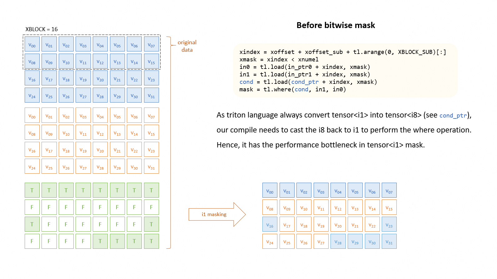
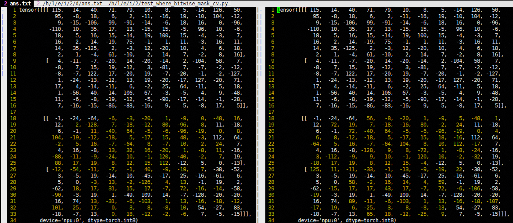

# 最佳实践案例

## 性能优化案例

### Tiling策略

**案例说明**：

基于GPU实现的Triton算子迁移到NPU时，通常发射的逻辑核数量远大于物理核，会有严重的启动及调度开销。建议在编写迁移时，调整Tiling策略，缩减核数，尽量使发射的逻辑核数量等于物理核，提升性能。本案例使用Triton实现。

```python
out = torch.gather(x, dim=1, index=idx)
```

**输入**：

| Input | Shape  |
|-------|--------|
| `x`   | `(B, C)` |
| `idx` | `(B, K)` |

**输出**：

| Input | Shape  |
|-------|--------|
| `out` | `(B, K)` |

**案例差异点详解**：

```diff
@triton.jit
def gather_dim1_kernel(
        x_ptr,  # *x  [B, C]
        idx_ptr,  # *idx[B, K]
        out_ptr,  # *out[B, K]
        stride_xb, stride_xc,
        stride_ib, stride_ik,
        stride_ob, stride_ok,
        B, K,
        BLOCK_B: tl.constexpr,
        BLOCK_K: tl.constexpr,
):
    pid_b = tl.program_id(0)  # 1 block per batch row
-   # GPU 实现
-   pid_k = tl.program_id(1)  # 1 block per K-tile

-   k_off = pid_k * BLOCK_K + tl.arange(0, BLOCK_K)
-   mask = k_off < K

-   idx = tl.load(idx_ptr + pid_b * stride_ib + k_off * stride_ik, mask=mask)  # [BLOCK_K]

-   x_val = tl.load(x_ptr + pid_b * stride_xb + idx * stride_xc, mask=mask)

-   tl.store(out_ptr + pid_b * stride_ob + k_off * stride_ok, x_val, mask=mask)

+   # NPU 实现
+   b_idx = pid_b * BLOCK_B + tl.arange(0, BLOCK_B)
+   b_mask = b_idx < B

+   # 对 K 维进行循环
+   for k_start in range(0, K, BLOCK_K):
+       ks = tl.arange(0, BLOCK_K)
+       k_mask = ks < K - k_start

+       idx_off = (b_idx[:, None] * stride_ib +
+                  (k_start + ks)[None, :] * stride_ik)
+       col_idx = tl.load(idx_ptr + idx_off, mask=b_mask[:, None] & k_mask)

+       x_off = (b_idx[:, None] * stride_xb +
+                col_idx * stride_xc)
+       x_val = tl.load(x_ptr + x_off, mask=b_mask[:, None] & k_mask)

+       out_off = (b_idx[:, None] * stride_ob +
+                  (k_start + ks)[None, :] * stride_ok)
+       tl.store(out_ptr + out_off, x_val, mask=b_mask[:, None] & k_mask)

# 调用
B = 128  # batch dim
K = 64  

BLOCK_B = 4
BLOCK_K = 128

- # GPU  
- grid = (B, triton.cdiv(K, BLOCK_K))
+ # NPU
+ grid = (triton.cdiv(B, BLOCK_B),)
```

### kernel昇腾亲和改写

**案例说明**：

原始GPU计算流程`i64`/`i32` `cmp`操作在NPU设备上无法使能`vector`，退化为scalar计算效率降低；通过转化为`fp32`来利用`vec_cast`和`vec_cmp`实现`vector`操作加速。需要注意的是，在`tl.load`和`tl.save`中的`mask`使用`cmp`功能，大部分情况下编译器可以自动优化为`vec`操作，本例中`tl.where`则需要手动转换。本案例以layerNorm为例说明实现向量化`cmp`加速NPU计算流程，该`cmp`操作用于处理layerNorm中的尾块处理。

**案例差异点详解**：

```diff
    cols = tl.arange(0, BLOCK_N)  # cols is int64
    x = tl.load(X + cols, mask=cols < N, other=0.0).to(tl.float32)

    # calculate mean & rstd
    mean = tl.sum(x, axis=0) / N
    tl.store(Mean + row, mean)
    
-   xbar = tl.where(cols < N, X - mean, 0.0)
+   # change cols(i64) into cols_cmp(f32) to enable vector processing
+   cols_cmp = cols.to(tl.float32)
+   xbar = tl.where(cols_cmp < N, x - mean, 0.0)

    var = tl.sum(xbar * xbar, axis=0) / N
```

## 功能或精度案例

本章节介绍常见功能或精度案例。

### 卡死类问题

**现象**：

算子选项规避超时报错，算子卡死的部分原因是与硬件同步相关，其中可能涉及核内/间同步，或涉及流水同步。若遇上算子卡死的情况，你可以尝试在调用Kernel时，传入以下入参，修改二进制的同步逻辑，以规避算子卡死的问题。

**写法样例**：

| 编译选项 | 数值 | 说明 |
|--------|------|------|
| `inject_barrier_all` | `false`(默认) | 前端尝试打开为`true`，如果卡死问题消失，证明核内同步有问题，适用`mix`/`aic`/`aiv`三类kernel |
| `inject_block_all` | `false`(默认) | 前端尝试打开为`true`，如果卡死问题消失，证明核间同步有问题，适用`mix`类kernel |

以GDN网络的`chunk_gated_delta_rule_fwd_kernel_h_blockdim64`算子为例，原代码写法样例调用如下：

```python
chunk_gated_delta_rule_fwd_kernel_h_blockdim64[grid](
    k=k,
    v=u,
    w=w,
    v_new=v_new,
    g=g,
    gk=gk,
    h=h,
    h0=initial_state,
    ht=final_state,
    cu_seqlens=cu_seqlens,
    chunk_offsets=chunk_offsets,
    T=T,
    H=H,
    K=K,
    V=V,
    BT=BT,
)
```

开启CV全流水后的写法样例为：

```python
chunk_gated_delta_rule_fwd_kernel_h_blockdim64[grid](
    k=k,
    v=u,
    w=w,
    v_new=v_new,
    g=g,
    gk=gk,
    h=h,
    h0=initial_state,
    ht=final_state,
    cu_seqlens=cu_seqlens,
    chunk_offsets=chunk_offsets,
    T=T,
    H=H,
    K=K,
    V=V,
    BT=BT,
    inject_block_all = True， # 开启核间同步
    inject_barrier_all = True # 开启核内同步
)
```

**参数入参不合理**：

对于`varlen`类的算子，通常会在`seqlen`中随机采样`indice`，需要保证`indice`的入参合理性。例如严格递增且在`[0, seqlen]`范围内。

### UB overflow类问题

#### triton argmax op先32B对齐，再融轴，浪费大量UB空间

**mlir代码如下**：

```mlir
%reinterpret_cast = memref.reinterpret_cast %arg3 to offset: [0], sizes: [256, 9, 11], strides: [99, 11, 1] : memref<?xi8, #hivm.address_space<gm>> to memref<256x9x11xi8, strided<[99, 11, 1]>, #hivm.address_space<gm>>
%2 = hivm.hir.pointer_cast(%c0_i64) : memref<256x32x11x1xi8, #hivm.address_space<ub>>
%subview = memref.subview %2[0, 0, 0, 0] [256, 9, 11, 1] [1, 1, 1, 1] : memref<256x32x11x1xi8, #hivm.address_space<ub>> to memref<256x9x11xi8, strided<[352, 11, 1]>, #hivm.address_space<ub>>
%collapse_shape = memref.collapse_shape %reinterpret_cast [[0], [1, 2]] : memref<256x9x11xi8, strided<[99, 11, 1]>, #hivm.address_space<gm>> into memref<256x99xi8, strided<[99, 1]>, #hivm.address_space<gm>>
%collapse_shape_0 = memref.collapse_shape %subview [[0], [1, 2]] : memref<256x9x11xi8, strided<[352, 11, 1]>, #hivm.address_space<ub>> into memref<256x99xi8, strided<[352, 1]>, #hivm.address_space<ub>>
hivm.hir.load ins(%collapse_shape : memref<256x99xi8, strided<[99, 1]>, #hivm.address_space<gm>>) outs(%collapse_shape_0 : memref<256x99xi8, strided<[352, 1]>, #hivm.address_space<ub>>) init_out_buffer = false may_implicit_transpose_with_last_axis = false
```

**分析**：

第1行，原始的数据大小为`256x9x11xi8`，保存在GM中（kernel的参数`%arg3`）；

第2行，申请一块大小为`256x32x11x1xi8`的UB空间，用于从GM中拷贝数据到UB，这里对第1轴进行了32字节对齐操作，同时尾轴增加一维；

第3行，对第2行申请的UB形状`256×32×11×1xi8`，通过subview提取`256x9x11xi8`的子视图；

第4行，通过`collapse_shape`，对第1行的GM中的视图`256x9x11xi8`，进行合并维度，变成`256x99xi8`类型；

第5行，通过`collapse_shape`，对第3行的UB中的视图`256x9x11xi8`，进行合并维度，变成`256x99xi8`类型；

第6行，将第4行的GM中形状为`256x99xi8`的数据，拷贝到第5行的UB中的`256x99xi8`形状中。

**总结**：

原始的数据`256x9x11xi8`大小为25344B；从GM中`load`到UB，UB中占用的大小（`256x32x11x1xi8`）为90112B，占用的UB大小为原始数据大小的3.5 倍多。

#### triton not op不合理的实现，导致额外占用内存

Triton Not OP的实现，在NPU-IR中，被转成`VOR`、`VAND`、`VNOT`、`VAND`等一系列操作来处理，实际上可以只执行`VNOT`操作：

**mlir代码如下**：

```mlir
  %2 = hivm.hir.pointer_cast(%c0_i64) : memref<65536xi8, #hivm.address_space<ub>>
  hivm.hir.load ins(%reinterpret_cast : memref<65536xi8, strided<[1]>, #hivm.address_space<gm>>) outs(%2 : memref<65536xi8, #hivm.address_space<ub>>) init_out_buffer = false may_implicit_transpose_with_last_axis = false
  %3 = hivm.hir.pointer_cast(%c131072_i64) : memref<65536xi8, #hivm.address_space<ub>>
  hivm.hir.vbrc ins(%c-1_i8 : i8) outs(%3 : memref<65536xi8, #hivm.address_space<ub>>)
  %4 = hivm.hir.pointer_cast(%c65536_i64) : memref<65536xi8, #hivm.address_space<ub>>
  hivm.hir.vor ins(%2, %3 : memref<65536xi8, #hivm.address_space<ub>>, memref<65536xi8, #hivm.address_space<ub>>) outs(%4 : memref<65536xi8, #hivm.address_space<ub>>)
  %5 = hivm.hir.pointer_cast(%c0_i64) : memref<65536xi8, #hivm.address_space<ub>>
  hivm.hir.vand ins(%2, %3 : memref<65536xi8, #hivm.address_space<ub>>, memref<65536xi8, #hivm.address_space<ub>>) outs(%5 : memref<65536xi8, #hivm.address_space<ub>>)
  hivm.hir.vnot ins(%5 : memref<65536xi8, #hivm.address_space<ub>>) outs(%5 : memref<65536xi8, #hivm.address_space<ub>>)
  %6 = hivm.hir.pointer_cast(%c65536_i64) : memref<65536xi8, #hivm.address_space<ub>>
  hivm.hir.vand ins(%5, %4 : memref<65536xi8, #hivm.address_space<ub>>, memref<65536xi8, #hivm.address_space<ub>>) outs(%6 : memref<65536xi8, #hivm.address_space<ub>>)
```

**分析**：

第1行，原始的数据大小为`65536xi8`，保存在GM中（kernel的参数`%arg3`）；

第2行，申请一块大小为`65536xi8`的UB空间；

第3行，将第1行的GM中的形状为`65536xi8`的数据，拷贝到第2行的形状为`65536xi8`的UB空间中；

第4行，申请一块大小为`65536xi8`的UB空间；

第5行，将第4行申请的`65536xi8`的UB空间，全填充-1；

第6行：申请一块大小为`65536xi8`的UB空间；

第7行：输入数据与-1做`or`运算，结果存储到第6行申请的UB空间中；

第8行：申请一块大小为`65536xi8`的UB空间；

第9行：输入数据与-1做`and`运算，结果存储到第8行申请的UB空间中；

第10行：再对第9行的结果做`not`运算，将结果存储到第8行申请的UB空间中；

第11行：申请一块大小为`65536xi8`的UB空间；

第12行：将第7行的结果，与第10行的结果，进行`and`运算，将结果存储到第11行申请的UB空间中。

**总结**：

对输入数据`input_data`进行`not`操作，`mlir`翻译成了如下运算：`(input_data|(-1))&(!(input_data&(-1)))`。

原始的数据大小为65536B，为了完成`(input_data|(-1))&(!(input_data&(-1)))`运算，申请了`5*65536B`的UB空间。

#### triton max_dim0 op在int64类型输入下，先执行PlanMemory，再执行HIVMLowerToLoops，浪费大量UB空间

**mlir代码如下**：

```mlir
%2 = hivm.hir.pointer_cast(%c0_i64) : memref<2x4912xi64, #hivm.address_space<ub>>
%3 = hivm.hir.pointer_cast(%c78592_i64) : memref<1x4912xi64, #hivm.address_space<ub>>
%4 = hivm.hir.pointer_cast(%c117888_i64) : memref<9824xi64, #hivm.address_space<ub>>
hivm.hir.vreduce {already_initialize_init} <max> ins(%2 : memref<2x4912xi64, #hivm.address_space<ub>>) outs(%3 : memref<1x4912xi64, #hivm.address_space<ub>>) temp_buffer(%4 : memref<9824xi64, #hivm.address_space<ub>>) reduce_dims = [0]
```

**分析**：

第1行，输入数据大小为`2x4912xi64`，在UB中分配，数据来源于GM；

第2行，输出数据大小为`1x4912xi64`，在UB中分配，存储计算结果，最后存储到GM中；

第3行，申请一块大小为`9824xi64`的UB空间作为`vreduce`操作的临时节点；

第4行，对于`int64`的输入，`vreduce`操作会在后面lower为`loop scalar`操作，并将`temp_buffer`删掉。

**总结**：

PlanMemory时考虑的`temp_buffer`在最后计算时并未使用，导致误报`ub overflow`，需要在PlanMemory前分配`temp_buffer`的步骤中修改临时节点分配规则。

### D-cache类

#### 无效地址访问

**现象**：

算子输入合法且均为同一个`deviceID`，实际算子的`deviceID`设置不正确，导致无法取到数据，出现D-cache读写错误。

**写法样例**：

错误样例：

```python
A=torch.empty(shape, dtype)
```

正确样例：

```python
A=torch.empty(shape, dtype).npu()
```

或：

```python
DEVICE="npu:0"
A=torch.empty(shape, dtype, device=DEVICE).npu()
```

#### 使用非负数iter arg作为访存索引

**现象**：

由于编译过程会对访存操作进行分析并优化编译结果，若访存操作的索引涉及到复杂的控制流（如`for`循环索引引入的访问越界），目前编译器或许没有能力完全覆盖，因此建议使用非负数的`for`循环`iter`参数作为访存索引。

**写法样例**：

以GDN网络的`causal_conv1d_fwd_kernel`为例，源代码中`i_w`可能是负数。

错误样例：

```python
for i_w in tl.static_range(-W+1, 1):
    p_yi = tl.make_block_ptr(x + bos * D, (T, D), (D, 1), (i_t * BT + i_w, i_d * BD), (BT, BD), (1, 0))
```

正确样例：

```python
for i_w in tl.static_range(W):
    p_yi = tl.make_block_ptr(x + bos * D, (T, D), (D, 1), (i_t * BT + i_w - W + 1, i_d * BD), (BT, BD), (1, 0))
```

### 访存类

#### Load隐式转置

**现象**：

"隐式转置"是指在加载或存储数据的同时完成矩阵转置操作，避免单独执行一个转置内核或额外的显式数据重排。它通常通过调整指针的步长和形状来实现，使得内存访问模式隐含地完成维度交换。这种技术可以节省全局内存带宽、减少内核启动开销，并提高计算效率。

`tl.make_block_ptr(base, shape, strides, offsets, block_shape, order)`

`order`参数指定内存中元素的迭代顺序，可以用来实现转置。或通过设置`strides`参数来指示转置后的步长。实际上，对于矩阵转置，如果我们有一个输入矩阵`A (M, K)`和输出矩阵`B (K, M)`，我们可以让每个线程块处理`B`的一个块，并从`A`中加载对应的转置块。加载时，可以使用`make_block_ptr`从`A`中加载，但步长设置为导致转置加载的步长？或更常见的做法是加载一个正常的`A`块，然后使用`tl.trans`转置后再存储到`B`。

```python
import torch
import triton
import triton.language as tl

@triton.jit
def transpose_kernel(
    x_ptr, y_ptr,
    M, N,
    stride_xm, stride_xn,
    stride_ym, stride_yn,
    BLOCK_M: tl.constexpr, BLOCK_N: tl.constexpr
):
    """
    矩阵转置内核：Y = X^T, 其中 X 形状 (M, N)，Y 形状 (N, M)。
    每个程序块处理 Y 的一个 (BLOCK_N, BLOCK_M) 子块。
    通过交换输入指针的步长，实现隐式转置加载。
    """
    pid_n = tl.program_id(0)  # 输出矩阵的行块索引（原列块）
    pid_m = tl.program_id(1)  # 输出矩阵的列块索引（原行块）

    bn = pid_n * BLOCK_N  # 输出矩阵的行起始 = 原列起始
    bm = pid_m * BLOCK_M  # 输出矩阵的列起始 = 原行起始

    # 构建输入指针：使用交换后的步长，形状 (N, M) 以匹配转置访问
    x_ptr_t = tl.make_block_ptr(
        base=x_ptr,
        shape=(N, M),
        strides=(stride_xn, stride_xm),
        offsets=(bn, bm),
        block_shape=(BLOCK_N, BLOCK_M),
        order=(1, 0)
    )

    # 构建输出指针：正常行主序步长，形状 (N, M)
    y_ptr_b = tl.make_block_ptr(
        base=y_ptr,
        shape=(N, M),
        strides=(stride_ym, stride_yn),
        offsets=(bn, bm),
        block_shape=(BLOCK_N, BLOCK_M),
        order=(1, 0)
    )

    # 加载输入块（已隐式转置），边界检查防止越界
    x_tile = tl.load(x_ptr_t, boundary_check=(0, 1))

    # 存储到输出矩阵
    tl.store(y_ptr_b, x_tile, boundary_check=(0, 1))


def transpose(x, y=None, BLOCK_M=64, BLOCK_N=32):
    """
    使用 Triton 内核计算矩阵转置。
    Args:
        x: torch.Tensor 形状 (M, N)
        y: 可选输出张量，形状 (N, M)，如果为 None 则自动创建
        BLOCK_M: 块大小（沿 M 维度）
        BLOCK_N: 块大小（沿 N 维度）
    Returns:
        y: 转置后的张量
    """
    M, N = x.shape
    if y is None:
        y = torch.empty(N, M, dtype=x.dtype, device=x.device)
    else:
        assert y.shape == (N, M), f"y 的形状应为 ({N}, {M})，但得到 {y.shape}"

    # 计算网格大小
    grid = (triton.cdiv(N, BLOCK_N), triton.cdiv(M, BLOCK_M))

    # 调用内核
    transpose_kernel[grid](
        x, y,
        M, N,
        x.stride(0), x.stride(1),
        y.stride(0), y.stride(1),
        BLOCK_M=BLOCK_M, BLOCK_N=BLOCK_N
    )
    return y

# 创建一个随机矩阵
x = torch.randn(512, 1024, device='npu')

# 调用转置函数
y = transpose(x)
```

执行结束不报错，证明运行成功。

#### 使用mayDiscretememaccess规避UB overflow

**现象**：

导致UB overflow的成因各异，除了本身张量数据类型过大，导致超出192KB的UB限制，另一个可能的原因是非连续搬运导致UB内扩轴。以`<Nx1xf32>`数据类型为例，由于硬件在尾轴需要32B对齐，而`1xf32`只有4B大小，因此`<Nx1xf32>`在硬件上的实际大小会被扩轴至`<Nx8xf32>`以确保32B对齐。无论因为什么原因导致的UB overflow，都可以通过加上`mayDiscretememaccess`的编译提示，使张量操作退化为标量操作，从而避免UB overflow。

**写法样例**：

改写算子时，只需在`load`/`store`操作的数据上加上`compile_hint`即可，参考以下代码段：

`triton-ascend 3.2.0`之前的版本：

```python
# 若为 load 操作，compile_hint 需加在加载出的 value 中
value = tl.load(pointer)
tl.compile_hint(value, "mayDiscretememaccess")

# 若为 store 操作，compile_hint 需加在被存入的 value 中
tl.compile_hint(value, "mayDiscretememaccess")
tl.store(pointer, value)
```

`triton-ascend 3.4.0`之后的版本需要改成：

```python
# 若为 load 操作，compile_hint 需加在加载出的 value 中
value = tl.load(pointer)
tl.extra.cann.extension.compile_hint(value, "mayDiscretememaccess")

# 若为 store 操作，compile_hint 需加在被存入的 value 中
tl.extra.cann.extension.compile_hint(value, "mayDiscretememaccess")
tl.store(pointer, value)
```

- **写法样例1**：

    ```python
    b_x = tl.load(x + o_t * D + o_d[:, None], mask=(m_t & m_d[:, None]), other=0)
    ```

    通过增加编译提示，张量访存会被退化为标量访存，避免UB overflow，参考以下代码段：

    ```python
    b_x = tl.load(x + o_t * D + o_d[:, None], mask=(m_t & m_d[:, None]), other=0)
    tl.extra.cann.extension.compile_hint(b_x, "mayDiscretememaccess")
    ```

- **写法样例2**：

    ```diff
    import triton
    import triton.language as tl
    + import triton.language.extra.cann.extension as extension
    
    @triton.jit
    def copy_column_major_to_row_major(
        A_ptr, B_ptr,
        M, N,
        BLOCK_SIZE_M: tl.constexpr, BLOCK_SIZE_N: tl.constexpr,
    ):
        # 获取程序 ID
        pid_m = tl.program_id(0)
        pid_n = tl.program_id(1)
    
        # 计算块起始位置
        start_m = pid_m * BLOCK_SIZE_M
        start_n = pid_n * BLOCK_SIZE_N
    
        # 创建 A 的块指针 (列主序: strides=(1, M))，此时最后一维不连续，会自动扩轴
        A_block_ptr = tl.make_block_ptr(
            base=A_ptr,
            shape=(M, N),
            strides=(1, M),
            offsets=(start_m, start_n),
            block_shape=(BLOCK_SIZE_M, BLOCK_SIZE_N),
            order=(0, 1),  # 最内层维度是行（索引 0），因为列主序
        )
    
        # 创建 B 的块指针 (行主序: strides=(N, 1))
        B_block_ptr = tl.make_block_ptr(
            base=B_ptr,
            shape=(M, N),
            strides=(N, 1),
            offsets=(start_m, start_n),
            block_shape=(BLOCK_SIZE_M, BLOCK_SIZE_N),
            order=(1, 0),  # 最内层维度是列（索引 1），因为行主序
        )
    
        # 加载 A 的块，进行边界检查（超出部分填充 0）
        a = tl.load(A_block_ptr, boundary_check=(0, 1))
    +   # npu
    +   extension.compile_hint(a, "mayDiscretememaccess")
    
        # 存储到 B
        tl.store(B_block_ptr, a, boundary_check=(0, 1))
    ```

**示例2使用`compile hint`前后的ir对比**：

```mlir
// before using tl.compile_hint(a, "mayDiscretememaccess")
module attributes {hacc.target = #hacc.target<"Ascend910B3">} {
  func.func @copy_column_major_to_row_major(%arg0: memref<?xi8> , %arg1: memref<?xi8> , %arg2: memref<?xf32> {tt.divisibility = 16 : i32, tt.tensor_kind = 0 : i32} , %arg3: memref<?xf32> {tt.divisibility = 16 : i32, tt.tensor_kind = 1 : i32} , %arg4: i32 {tt.divisibility = 16 : i32} , %arg5: i32 {tt.divisibility = 16 : i32} , %arg6: i32 , %arg7: i32 , %arg8: i32 , %arg9: i32 , %arg10: i32 , %arg11: i32 ) attributes {SyncBlockLockArgIdx = 0 : i64, WorkspaceArgIdx = 1 : i64, global_kernel = "local", mix_mode = "aiv", parallel_mode = "simd"} {
    %c64 = arith.constant 64 : index 
    %c0 = arith.constant 0 : index 
    %c0_i32 = arith.constant 0 : i32 
    %c64_i32 = arith.constant 64 : i32 
    %0 = arith.muli %arg9, %c64_i32 : i32 
    %1 = arith.muli %arg10, %c64_i32 : i32 
    %2 = arith.maxsi %0, %c0_i32 : i32 
    %3 = arith.index_cast %2 : i32 to index 
    %4 = arith.maxsi %1, %c0_i32 : i32 
    %5 = arith.index_cast %4 : i32 to index 
    %6 = arith.index_cast %arg5 : i32 to index 
    %7 = arith.muli %3, %6 : index 
    %8 = arith.index_cast %arg4 : i32 to index 
    %9 = arith.addi %7, %5 : index 
    %reinterpret_cast = memref.reinterpret_cast %arg3 to offset: [%9], sizes: [64, 64], strides: [%6, 1] : memref<?xf32> to memref<64x64xf32, strided<[?, 1], offset: ?>> 
    %10 = arith.muli %5, %8 : index 
    %11 = arith.addi %10, %3 : index 
    %reinterpret_cast_0 = memref.reinterpret_cast %arg2 to offset: [%11], sizes: [64, 64], strides: [%8, 1] : memref<?xf32> to memref<64x64xf32, strided<[?, 1], offset: ?>> 
    %alloc = memref.alloc() : memref<64x64xf32> 
    %12 = arith.divsi %11, %8 : index 
    %13 = arith.subi %6, %12 : index 
    %14 = arith.maxsi %13, %c0 : index 
    %15 = arith.minsi %14, %c64 : index 
    %16 = arith.remsi %11, %8 : index 
    %17 = arith.subi %8, %16 : index 
    %18 = arith.maxsi %17, %c0 : index 
    %19 = arith.minsi %18, %c64 : index 
    %20 = arith.subi %c0_i32, %1 : i32 
    %21 = arith.maxsi %20, %c0_i32 : i32 
    %22 = arith.index_cast %21 : i32 to index 
    %23 = arith.minsi %22, %15 : index 
    %24 = arith.subi %15, %23 : index 
    %25 = arith.subi %c0_i32, %0 : i32 
    %26 = arith.maxsi %25, %c0_i32 : i32 
    %27 = arith.index_cast %26 : i32 to index 
    %28 = arith.minsi %27, %19 : index 
    %29 = arith.subi %19, %28 : index 
    %subview = memref.subview %reinterpret_cast_0[0, 0] [%24, %29] [1, 1] : memref<64x64xf32, strided<[?, 1], offset: ?>> to memref<?x?xf32, strided<[?, 1], offset: ?>> 
    %subview_1 = memref.subview %alloc[%23, %28] [%24, %29] [1, 1] : memref<64x64xf32> to memref<?x?xf32, strided<[64, 1], offset: ?>> 
    memref.copy %subview, %subview_1 : memref<?x?xf32, strided<[?, 1], offset: ?>> to memref<?x?xf32, strided<[64, 1], offset: ?>> 
    %30 = bufferization.to_tensor %alloc restrict writable : memref<64x64xf32> 
    %31 = tensor.empty() : tensor<64x64xf32> 
    %transposed = linalg.transpose ins(%30 : tensor<64x64xf32>) outs(%31 : tensor<64x64xf32>) permutation = [1, 0]  
    %32 = arith.divsi %9, %6 : index 
    %33 = arith.subi %8, %32 : index 
    %34 = arith.maxsi %33, %c0 : index 
    %35 = arith.minsi %34, %c64 : index 
    %36 = arith.remsi %9, %6 : index 
    %37 = arith.subi %6, %36 : index 
    %38 = arith.maxsi %37, %c0 : index 
    %39 = arith.minsi %38, %c64 : index 
    %40 = arith.minsi %27, %35 : index 
    %41 = arith.subi %35, %40 : index 
    %42 = arith.minsi %22, %39 : index 
    %43 = arith.subi %39, %42 : index 
    %extracted_slice = tensor.extract_slice %transposed[%40, %42] [%41, %43] [1, 1] : tensor<64x64xf32> to tensor<?x?xf32> 
    %subview_2 = memref.subview %reinterpret_cast[0, 0] [%41, %43] [1, 1] : memref<64x64xf32, strided<[?, 1], offset: ?>> to memref<?x?xf32, strided<[?, 1], offset: ?>> 
    bufferization.materialize_in_destination %extracted_slice in writable %subview_2 : (tensor<?x?xf32>, memref<?x?xf32, strided<[?, 1], offset: ?>>) -> () 
    return 
  } 
} 
```

```mlir
// after using tl.compile_hint(a, "mayDiscretememaccess")
module attributes {hacc.target = #hacc.target<"Ascend910B3">} {
  func.func @copy_column_major_to_row_major(%arg0: memref<?xi8> , %arg1: memref<?xi8> , %arg2: memref<?xf32> {tt.divisibility = 16 : i32, tt.tensor_kind = 0 : i32} , %arg3: memref<?xf32> {tt.divisibility = 16 : i32, tt.tensor_kind = 1 : i32} , %arg4: i32 {tt.divisibility = 16 : i32} , %arg5: i32 {tt.divisibility = 16 : i32} , %arg6: i32 , %arg7: i32 , %arg8: i32 , %arg9: i32 , %arg10: i32 , %arg11: i32 ) attributes {SyncBlockLockArgIdx = 0 : i64, WorkspaceArgIdx = 1 : i64, global_kernel = "local", mix_mode = "aiv", parallel_mode = "simd"} {
    %c0_i32 = arith.constant 0 : i32
    %c64 = arith.constant 64 : index
    %c1 = arith.constant 1 : index
    %c0 = arith.constant 0 : index
    %c64_i32 = arith.constant 64 : i32
    %0 = arith.muli %arg9, %c64_i32 : i32
    %1 = arith.muli %arg10, %c64_i32 : i32
    %2 = arith.extsi %arg5 : i32 to i64
    %3 = arith.maxsi %1, %c0_i32 : i32
    %4 = arith.index_cast %3 : i32 to index
    %5 = arith.maxsi %0, %c0_i32 : i32
    %6 = arith.index_cast %5 : i32 to index
    %7 = arith.index_cast %arg4 : i32 to index
    %8 = arith.muli %4, %7 : index
    %9 = arith.index_cast %arg5 : i32 to index
    %10 = arith.addi %8, %6 : index
    %reinterpret_cast = memref.reinterpret_cast %arg2 to offset: [%10], sizes: [64, 64], strides: [%7, 1] : memref<?xf32> to memref<64x64xf32, strided<[?, 1], offset: ?>>
    %alloc = memref.alloc() : memref<64x64xf32>
    %11 = arith.divsi %10, %7 : index
    %12 = arith.subi %9, %11 : index
    %13 = arith.maxsi %12, %c0 : index
    %14 = arith.minsi %13, %c64 : index
    %15 = arith.remsi %10, %7 : index
    %16 = arith.subi %7, %15 : index
    %17 = arith.maxsi %16, %c0 : index
    %18 = arith.minsi %17, %c64 : index
    %19 = arith.subi %c0_i32, %1 : i32
    %20 = arith.maxsi %19, %c0_i32 : i32
    %21 = arith.index_cast %20 : i32 to index
    %22 = arith.minsi %21, %14 : index
    %23 = arith.subi %14, %22 : index
    %24 = arith.subi %c0_i32, %0 : i32
    %25 = arith.maxsi %24, %c0_i32 : i32
    %26 = arith.index_cast %25 : i32 to index
    %27 = arith.minsi %26, %18 : index
    %28 = arith.subi %18, %27 : index
    %subview = memref.subview %reinterpret_cast[0, 0] [%23, %28] [1, 1] : memref<64x64xf32, strided<[?, 1], offset: ?>> to memref<?x?xf32, strided<[?, 1], offset: ?>>
    %subview_0 = memref.subview %alloc[%22, %27] [%23, %28] [1, 1] : memref<64x64xf32> to memref<?x?xf32, strided<[64, 1], offset: ?>>
    memref.copy %subview, %subview_0 : memref<?x?xf32, strided<[?, 1], offset: ?>> to memref<?x?xf32, strided<[64, 1], offset: ?>>
    %29 = bufferization.to_tensor %alloc restrict writable : memref<64x64xf32>
    %30 = tensor.empty() : tensor<64x64xf32>
    %transposed = linalg.transpose ins(%29 : tensor<64x64xf32>) outs(%30 : tensor<64x64xf32>) permutation = [1, 0] 
    %31 = arith.index_cast %arg4 : i32 to index
    %32 = arith.minsi %31, %c64 : index
    scf.for %arg12 = %c0 to %32 step %c1 {
      %33 = arith.index_cast %arg5 : i32 to index
      %34 = arith.minsi %33, %c64 : index
      scf.for %arg13 = %c0 to %34 step %c1 {
        %35 = arith.index_cast %arg12 : index to i64
        %36 = arith.extsi %0 : i32 to i64
        %37 = arith.muli %2, %36 : i64
        %38 = arith.muli %2, %35 : i64
        %39 = arith.addi %37, %38 : i64
        %40 = arith.index_cast %arg13 : index to i64
        %41 = arith.extsi %1 : i32 to i64
        %42 = arith.addi %39, %41 : i64
        %43 = arith.addi %42, %40 : i64
        %44 = arith.index_cast %43 : i64 to index
        %extracted = tensor.extract %transposed[%arg12, %arg13] {DiscreteMemAccess} : tensor<64x64xf32>
        %45 = tensor.empty() : tensor<1xf32>
        %inserted = tensor.insert %extracted into %45[%c0] : tensor<1xf32>
        %reinterpret_cast_1 = memref.reinterpret_cast %arg3 to offset: [%44], sizes: [1], strides: [1] : memref<?xf32> to memref<1xf32, strided<[1], offset: ?>>
        bufferization.materialize_in_destination %inserted in writable %reinterpret_cast_1 : (tensor<1xf32>, memref<1xf32, strided<[1], offset: ?>>) -> ()
      } {ExtractedLoadOrStore}
    } {ExtractedLoadOrStore}
    return
  }
}
```

## 场景化调试举例

本章节介绍Triton NPU算子性能优化指南。

### 使用bitwise_mask优化访存掩码

**问题描述**：

在昇腾硬件上，布尔类型（`i1`）的张量在全局内存（GM）中实际是按`i8`（一个字节）存储的。当Triton Ascend处理以`i1`张量作为输入的运算时，它会将`i1`视为`i8`搬入，但某些情况下（例如作为`tl.where`的条件掩码）又需要将结果转换回`i1`，导致不必要的类型转换，带来性能损耗。

为了解决这个问题，提供了`compile_hint: "bitwise_mask"`。通过该提示，编译器可以识别出该`i1`张量是作为位掩码使用的，从而直接按位操作，避免中间的类型转换，提升性能。

具体使用方法只需在`where`后的结果加上`compile_hint("bitwise_mask")`即可，参考以下代码段：

```python
mask = tl.where(cond, value1, value2)
tl.compile_hint(cond, "bitwise_mask")
```

需注意，由于`mask`以`bitmask`的形式表达，因此对应的`mask`指针偏移量也需正确运算。




> **说明**：
>
> 使用`compile_hint`需要注意本地的`TA`版本。
>
> `triton-ascend 3.2.0`之前的版本：`tl.compile_hint(cond, "bitwise_mask")`
>
> `triton-ascend 3.4.0`之后的版本需要改成：`tl.extra.cann.extension.compile_hint(cond, "bitwise_mask")`
>
> `bitmask`功能`cann9.0`之后的版本才有，因此需要下载`cann.9.0`之后的版本。

**算子示例**：

参考[Ascend where算子](https://gitcode.com/Ascend/triton-ascend/blob/master/ascend/examples/pytest_ut/test_where_lt.py)进行改写，若用户需要输入`bitwise`的`i8`掩码作为算子入参，只需为`tl.where`的结果加上`compile_hint`即可。

其中依赖的代码脚本请下载链接，并将其和测试脚本放在同个目录下执行`python3 test_bitmask.py`。

[triton testcommon script](https://gitcode.com/Ascend/triton-ascend/blob/master/ascend/examples/pytest_ut/test_common.py)

```python
# test_bitmask.py
import triton
import triton.language as tl
import torch 
import torch_npu
import test_common

@triton.jit
def triton_where_lt_case1(in_ptr0, in_ptr1, cond_ptr, out_ptr0, xnumel, XBLOCK: tl.constexpr, XBLOCK_SUB: tl.constexpr):
    xoffset = tl.program_id(0) * XBLOCK
    for xoffset_sub in range(0, XBLOCK, XBLOCK_SUB):
        xindex = xoffset + xoffset_sub + tl.arange(0, XBLOCK_SUB)[:]
        xmask = xindex < xnumel
        in0 = tl.load(in_ptr0 + xindex, xmask)
        in1 = tl.load(in_ptr1 + xindex, xmask)
        cond = tl.load(cond_ptr + xindex, xmask)
        res = tl.where(cond, in1, in0)
        # versions after triton-ascend 3.4.0
        # tl.extra.cann.extension.compile_hint(cond, "bitwise_mask")
        # versions before triton-ascend 3.2.0
        tl.compile_hint(cond, "bitwise_mask")
        tl.store(out_ptr0 + (xindex), res, xmask)

def test_where_lt_case1():
       dtype = "float32"
       shape = (1, 1024, 8) 
       ncore = 1 
       xblock = 8192
       xblock_sub = 1024
       if shape[-1] %8 != 0:
           raise ValueError("The last dimension should be a multiple of 8")
       x0 = test_common.generate_tensor(shape, dtype).npu()
       x1 = test_common.generate_tensor(shape, dtype).npu()
       # Run triton with i8 bitwise mask
       cond_i8 = test_common.generate_tensor(shape, 'uint8').npu()
       y_cal = test_common.generate_tensor(shape, dtype).npu()
       triton_where_lt_case1[ncore, 1, 1](x0, x1, cond_i8, y_cal, x0.numel(), xblock, xblock_sub)
       
test_where_lt_case1()
```

执行结束不报错，证明运行成功。

**切分逻辑**：

`bitmask`与切分逻辑绑定，算子自身在不同场景下有不同的切分逻辑，主要覆盖以下场景：

- CV场景下使能1:2性能优化
- 融轴
- `broadcast`场景
- 非硬件支撑的数据类型
- Triton算子输入非1的grid切块

因场景分片逻辑不统一，现提供一个泛化的组`mask`样例：通过`i8 bitmask`组出`i1`的标杆`mask`。该组`mask`逻辑不考虑场景，是从`bitmask`结果的误差推导组`mask`逻辑的。

假设这是本来的组`mask`逻辑：

```python
for i in range(numel // 8):
    byte_value = flatten_cond_i8[i]
    for bit in range(8):
        flatten_cond_i1[..., i*8 + bit] = (byte_value & (1 << bit)) != 0
```

假设在某个场景下，shape为`(2，X，X，X)`时，vimdiff结果为：


而在同一场景下，shape为`(3，X，X，X)`时，vimdiff结果为：


由此感知，当shape为`(A, X, X, X)`时，上述场景的切分逻辑是按首轴（即`A`）处理，错误的组`mask`逻辑导致只有首轴的首个切分精度对齐，而剩下的有`(A-1)/A`的数据则有偏差，如此，精度验证的标杆组`mask`逻辑就需要考虑`A`了，见以下代码：

```python
for sub_A in range(A):
    # The offset calculation depends on the logic of the kernel
    offset_sub_A = D * B * sub_A
    for i in range(min(numel, B * D) // 8):
        byte_value = flatten_cond_i8[offset_sub_A + i]
        for bit in range(8):
            flatten_cond_i1[..., offset_sub_A + i*8 + bit] = (byte_value & (1 << bit)) != 0
```

通过上述的最佳实践，`bitmask`功能即可通过高度泛化的方法正确实现。

此外，以下提供多重切分的逻辑供参考：

```python
# test_bitmask_tile.py
import triton
import triton.language as tl
import torch
import torch_npu
import pytest
import test_common
from itertools import product

def torch_where_lt_case1(x0, x1, cond):
    res = torch.where(cond, x0, x1)
    return res

@triton.jit
def triton_bitmask(in_ptr0, in_ptr1, cond_ptr, out_ptr0,
                          X_BLOCK_SIZE: tl.constexpr, Y_BLOCK_SIZE: tl.constexpr, Z_BLOCK_SIZE: tl.constexpr,
                          X_STRIDE: tl.constexpr, Y_STRIDE: tl.constexpr, Z_STRIDE: tl.constexpr):
    # Calculate the offset according to the grid
    xoffset = tl.program_id(0) * X_BLOCK_SIZE
    yoffset = tl.program_id(1) * Y_BLOCK_SIZE
    zoffset = tl.program_id(2) * Z_BLOCK_SIZE
    xindex = X_STRIDE * (xoffset + tl.arange(0, X_BLOCK_SIZE))[:, None, None]
    yindex = Y_STRIDE * (yoffset + tl.arange(0, Y_BLOCK_SIZE))[None, :, None]
    zindex = Z_STRIDE * (zoffset + tl.arange(0, Z_BLOCK_SIZE))[None, None, :]
    offset = xindex + yindex + zindex
    # Load in0 and in1
    in0 = tl.load(in_ptr0 + offset)
    in1 = tl.load(in_ptr1 + offset)
    cond = tl.load(cond_ptr + offset)
    # bitwise where and store
    mask = tl.where(cond, in0, in1)
    # versions after triton-ascend 3.4.0
    # tl.extra.cann.extension.compile_hint(mask, "bitwise_mask")
    # versions before triton-ascend 3.2.0
    tl.compile_hint(mask, "bitwise_mask")
    tl.store(out_ptr0 + offset, mask)

@pytest.mark.parametrize('param_list',
                         [
                            ['float32', (16, 16, 32), (2, 2, 2)],
                            ['int32', (16, 32, 16), (2, 2, 2)],
                            ['int16', (32, 16, 16), (2, 2, 2)],
                            ['float16', (8, 8, 64), (8, 8, 8)],
                            ['float32', (8, 8, 24), (4, 4, 3)],
                            ['int32', (1, 1, 1024), (1, 1, 16)],
                            ['int16', (1, 1, 16), (1, 1, 2)],
                            ['float16', (8, 80, 16), (1, 80, 2)],
                         ]
                        )
def test_where_lt_case1(param_list):
    # Checking and constant value creation
    dtype, shape, grid = param_list
    if shape[0] % shape[0] != 0 or \
       shape[1] % shape[1] != 0 or \
       shape[2] % shape[2] != 0 :
        raise ValueError("Shape is not divisible by grid")

    x_block_size = shape[0] // grid[0]
    y_block_size = shape[1] // grid[1]
    z_block_size = shape[2] // grid[2]
    if z_block_size%8 != 0:
        raise ValueError("The last dimension should be a multiple of 8")

    if grid[-1] == 1:
        raise ValueError("Please tile the last dim")

    if(dtype in ["bool", "int8", "uint8", "int64"]):
        raise ValueError(f"The torch mask tiling logic is not applicable with {dtype} type")

    x_stride = shape[-1] * shape[-2]
    y_stride = shape[-1]
    z_stride = 1

    # Run triton with i8 bitwise mask
    x0 = test_common.generate_tensor(shape, dtype).npu()
    x1 = test_common.generate_tensor(shape, dtype).npu()
    cond_i8 = test_common.generate_tensor(shape, 'uint8').npu()
    y_cal = test_common.generate_tensor(shape, dtype).npu()
    triton_bitmask[grid](x0, x1, cond_i8, y_cal, x_block_size, y_block_size, z_block_size, x_stride, y_stride, z_stride)

    # Run torch with i1 mask
    flatten_cond_bool = torch.zeros(cond_i8.flatten().shape, dtype=torch.bool).npu()
    for x_block_id, y_block_id, z_block_id in product(range(grid[0]), range(grid[1]), range(grid[2])):
        flatten_subview_cond_i8 = cond_i8[x_block_id * x_block_size: (x_block_id+1) * x_block_size,
                                  y_block_id * y_block_size: (y_block_id+1) * y_block_size,
                                  z_block_id * z_block_size: (z_block_id+1) * z_block_size].flatten()
        for i in range(flatten_subview_cond_i8.shape[-1]// 8):
            # Get the corresponding i8 value
            i8_z_block_offset = i % (z_block_size // 8)
            i8_y_block_offset = i // (z_block_size // 8) % y_block_size * z_block_size
            i8_x_block_offset = i // (z_block_size // 8) // y_block_size * y_block_size * z_block_size
            i8_offset = i8_z_block_offset + i8_y_block_offset + i8_x_block_offset
            byte_value = flatten_subview_cond_i8[i8_offset]
            # Set the corresponding i1 value
            i1_z_block_offset = (z_block_id * z_block_size + (i * 8) % z_block_size) * z_stride
            i1_y_block_offset = (y_block_id * y_block_size + (i * 8) // z_block_size % y_block_size) * y_stride
            i1_x_block_offset = (x_block_id * x_block_size + (i * 8) // z_block_size // y_block_size) * x_stride
            i1_offset = i1_x_block_offset + i1_y_block_offset + i1_z_block_offset
            for bit in range(8):
                flatten_cond_bool[..., i1_offset + bit] = (byte_value & (1 << bit)) != 0
    cond_bool = flatten_cond_bool.view(shape)
    y_ref = torch_where_lt_case1(x0, x1, cond_bool)
    # Precision test
    print("y_cal: ", y_cal)
    print("y_ref: ", y_ref)
    test_common.validate_cmp(dtype, y_cal, y_ref)
```

> **注意**：
>
> 由于Triton前端会将`i1`转换为`i8`，如果对其他类型如`i16`/`i32`等进行`bitwise_mask`操作反而会带来性能损耗，因此此功能只支持`i8`类型的`mask`。

### 使用手动对齐提升尾轴不对齐场景的编译器优化效率

**问题描述**：

在Triton算子开发中，当张量的尾轴维度较小（如4）且未对齐到硬件建议的32字节（对应8个`float32`元素）时，编译器后端在处理此类非对齐形状时，往往难以生成最优的连续访存和向量化指令，导致性能无法充分发挥。为获得更好的编译器优化效果，推荐开发者在前端kernel中通过手动填充（padding）或mask加载的方式，将数据尾轴维度显式对齐到合适的宽度，从而为编译器提供对齐友好的数据布局。这样能够简化后端的优化决策，显著提升执行效率。

**算子示例**：

以下展示了尾轴为4的两种kernel实现：版本1直接使用4作为尾轴维度，未做对齐处理，性能较差；版本2通过`mask`加载将尾轴维度对齐至8，是推荐的优化写法。

- 版本1：尾轴未对齐（存在优化瓶颈）

    ```python
    @triton.jit
    def kernel(in_ptr, out_ptr, batch_size,
                D: tl.constexpr, iters: tl.constexpr,
                eps: tl.constexpr, group: tl.constexpr):
        lin = tl.arange(0, D * D)
        pid0 = tl.program_id(0) * group
        pids = pid0 + tl.arange(0, group)
        mask = pids < batch_size
        off = pids[:, None] * (D * D)

        # 直接加载 D×D 矩阵，无对齐填充
        mat = tl.load(in_ptr + off + lin[None, :], mask=mask[:, None])
        mat = mat.reshape(group, D, D)

        row_max = tl.max(mat, axis=2)
        mat = tl.exp(mat - row_max[:, :, None])
        for _ in range(iters):
            row_sum = tl.sum(mat, axis=2)
            mat = mat / (row_sum[:, :, None] + eps)
            col_sum = tl.sum(mat, axis=1)
            mat = mat / (col_sum[:, None, :] + eps)

        mat_flat = tl.reshape(mat, (group, D * D))
        tl.store(out_ptr + off + lin[None, :], mat_flat, mask=mask[:, None])
    ```

- 版本2：手动对齐（推荐）

    ```python
    @triton.jit
    def kernel_opt(in_ptr, out_ptr, batch_size,
                    D: tl.constexpr, iters: tl.constexpr,
                    eps: tl.constexpr, group: tl.constexpr,
                    ALIGN: tl.constexpr = 8):
        pid0 = tl.program_id(0) * group
        pids = pid0 + tl.arange(0, group)
        p_mask = pids < batch_size
    
        # 基于原始 D×D 形状，每次加载 ALIGN 个元素
        off_base = pids[:, None, None] * (D * D)
        row_idx = tl.arange(0, D)[:, None]
        col_idx = tl.arange(0, ALIGN)[None, :]
        offs = row_idx * D + col_idx
        valid_cols = col_idx < D
    
        # 通过掩码将无效列填充为 -inf，实现手动对齐
        # 形状 (group, D, ALIGN)
        mat = tl.load(
            in_ptr + off_base + offs[None, :, :],
            mask=p_mask[:, None, None] & valid_cols[None, :, :],
            other=float('-inf')
        )
    
        # 归一化计算（无效列在 exp 后变为 0，不影响结果）
        row_max = tl.max(mat, axis=2)
        mat = tl.exp(mat - row_max[:, :, None])
        for _ in range(iters):
            row_sum = tl.sum(mat, axis=2)
            mat = mat / (row_sum[:, :, None] + eps)
            col_sum = tl.sum(mat, axis=1)
            mat = mat / (col_sum[:, None, :] + eps)
    
        # 按 ALIGN 对齐宽度写回
        out_flat = tl.reshape(mat, (group, D * ALIGN))
        tl.store(out_ptr + pids[:, None] * (D * ALIGN)
                + tl.arange(0, D * ALIGN)[None, :],
                out_flat, mask=p_mask[:, None])
    ```

    版本2通过手动将尾轴维度对齐到8，编译器可以直接利用连续、对齐的访存模式生成高效指令，避免了因尾轴不对齐可能引入的额外处理开销，从而提升整体性能。

    > **注意**：
    >
    > - 手动对齐要求ALIGN为编译期常量，且应等于硬件建议的对齐宽度。
    >
    > - 填充值（如`-inf`）需与后续计算兼容，确保不影响最终结果（例如`exp(-inf) = 0`）。

### CV类

#### 使用hivm.tile_mix_cube_num规避L1越界

**问题描述**：

由于编译器目前只能对单个`matmul`进行切分需求分析，并不考虑其他`matmul`的生命周期，因此当`matmul`被多次触发时（例如执行逻辑为`cube -> vector -> cube`时），若上一个`matmul`的生命周期和当前的`matmul`生命周期有所重叠，算子运行时可能会导致L1越界。后续编译器会对切分的生命周期分析进行增强，目前则需通过加上`hivm.tile_mix_cube_num`编译提示，令编译器可以感知是否需要对相关的`matmul`操作进行sub tiling。

**算子示例**：

改写算子时，只需为`dot`操作结果加上`hivm.tile_mix_cube_num`的编译提示即可，参考以下代码段：

```python
res = tl.dot(lhs, rhs)
tl.compile_hint(res, "hivm.tile_mix_cube_num", 2)
```

以Flash Attention的`_attn_fwd_inner`算子为例，原代码的`QKV`矩阵乘法逻辑大致为：

```python
qk = tl.dot(q, trans_k)
# softmax calculation in between
qk = ...
p = tl.math.exp(qk)
pv = tl.dot(p, v)
```

参考以上代码，`qk`是`cube`操作，而`softmax`等计算属于`vector`操作，最后`vector`计算出的结果又再导入到第二次的`cube`操作中执行矩阵乘法。在以上场景下，编译器无法监控第二次`cube`操作中的切分逻辑，代码或许会在L1缓存中越界。因此，需要为第二次的`dot`操作结果加上`tile_mix_cube_num`的编译提示，令编译器对该操作进行sub tiling，见以下代码段：

```python
qk = tl.dot(q, trans_k)
# softmax calculation in between
qk = ...
p = tl.math.exp(qk)
pv = tl.dot(p, v)
tl.compile_hint(pv, "hivm.tile_mix_cube_num", 2)
```

**编译优化选项参考**：

| 编译选项 | 含义 | 取值范围 |
| --- | --- | --- |
| `multibuffer` | 设置是否启用乒乓流水 | `False`(默认),`True` |
| `limit_auto_multi_buffer_of_local_buffer` | 设置乒乓流水在片中 (L1, L0, 及UB) 的作用范围"no-limit"表示不限乒乓流水范围"no-l0c"表示只允许L0缓存外启用乒乓流水 | "no-limit","no-l0c"(默认) |
| `unit_flag` | 设置`cube`搬出时是否按照block搬出，仅限数据对齐场景下使用 | `False`(默认),`True` |
| `limit_auto_multi_buffer_only_for_local_buffer` | 设置是否在GM workspace中启用CV流水并行，`False`表示启用后续会整改接口，提供更可读的选项 | `False`(默认),`True` |
| `set_workspace_multibuffer` | 仅在`limit_auto_multi_buffer_only_for_local_buffer=false`的场景下生效。设置CV并行的并行度使用时需确保数据没有依赖若设置为`N`，则`N`个CV操作并行执行 | 2(默认),4 |
| `tile_mix_vector_loop` | 仅在`limit_auto_multi_buffer_only_for_local_buffer=false`的场景下生效。设置当前`vector`的切分数量，数值可由`autotuning`得出，均可为最优 | 1(默认),2,4 |
| `tile_mix_cube_loop` | 仅在`limit_auto_multi_buffer_only_for_local_buffer=false`的场景下生效。设置当前`cube`的切分数量，数值可由`autotuning`得出，均可为最优 | 1(默认),2,4 |

#### 算子选项规避超时报错

**问题描述**：

导致算子卡死的部分原因是与硬件同步相关，其中可能涉及核内/间同步或流水同步。若遇上算子卡死的情况，你可以尝试在调用Kernel时，传入以下入参，修改二进制的同步逻辑以规避算子卡死的问题。

```python
# 核同步选项
inject_block_all = True # 开启核间同步
inject_barrier_all = True # 开启核内同步
# 流水选项
limit_auto_multi_buffer_only_for_local_buffer = True # 关闭 (GM space) CV 流水
multibuffer = False # 关闭乒乓流水
```

**算子示例**：

以GDN网络的`chunk_gated_delta_rule_fwd_kernel_h_blockdim64`算子为例，原代码调用为：

```python
chunk_gated_delta_rule_fwd_kernel_h_blockdim64[grid](
    k=k,
    v=u,
    w=w,
    v_new=v_new,
    g=g,
    gk=gk,
    h=h,
    h0=initial_state,
    ht=final_state,
    cu_seqlens=cu_seqlens,
    chunk_offsets=chunk_offsets,
    T=T,
    H=H,
    K=K,
    V=V,
    BT=BT,
)
```

关闭CV流水后的调用则为：

```python
chunk_gated_delta_rule_fwd_kernel_h_blockdim64[grid](
    k=k,
    v=u,
    w=w,
    v_new=v_new,
    g=g,
    gk=gk,
    h=h,
    h0=initial_state,
    ht=final_state,
    cu_seqlens=cu_seqlens,
    chunk_offsets=chunk_offsets,
    T=T,
    H=H,
    K=K,
    V=V,
    BT=BT,
    limit_auto_multi_buffer_only_for_local_buffer = True,
)
```

## Triton NPU编程案例

Triton NPU编程请参考：[https://github.com/Ascend/triton-ascend-ops/blob/main/tutorial/README.zh.md](https://github.com/Ascend/triton-ascend-ops/blob/main/tutorial/README.zh.md)
