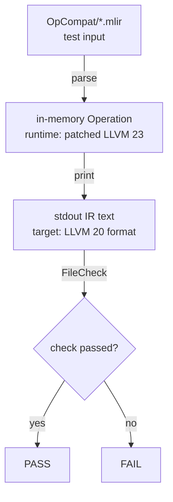

# LLVM OP Text Compatibility Guard (LLVM20Compat)

## Background

TritonAscend needs to follow upstream Triton's LLVM upgrades, while the current Ascend NPU-IR (NPUIR below) is still based on LLVM 19.
When TritonAscend is upgraded to 3.7.0, the underlying LLVM is LLVM 23 (commit: ac5dc54). The two LLVM versions do not match. Without a compatibility layer, the following issues appear:

* MLIR dialect, op, and attribute parsing fails
* IR semantics or structure is incompatible, and compilation stops

> TritonAscend 3.2.2 uses LLVM 20 (commit: b5cc222). Its IR text format is largely compatible with NPUIR (LLVM 19). This compatibility work therefore uses LLVM 20 (commit: b5cc222) as the target baseline: patches on LLVM 23 change printing so that the emitted IR text matches LLVM 20.

## Terminology

Core terms used in this document:

| Term | Meaning |
| --- | --- |
| **parse** | Read `.mlir` text into memory and build MLIR IR objects |
| **print** | Serialize in-memory IR objects to MLIR text; this is the main check of the compatibility guard |
| **pretty form** | Concise native assembly of an op, e.g. `arith.divsi %a, %b : i32` |
| **generic form** | MLIR fallback format: quoted op name, attributes in `{...}`; all versions can parse it |
| **print elision** | At print time, omit fields that LLVM 23 added so the output matches LLVM 20 |

### Two textual forms

Generic form is MLIR's built-in fallback and can be parsed by any version.

**Pretty form vs generic form** (division as an example):

Example 1 — pretty form:

```mlir
%0 = arith.divsi %a, %b : i32
```

Example 2 — generic form (often used to attach new attributes in tests):

```mlir
%0 = "arith.divsi"(%a, %b) {isExact} : (i32, i32) -> i32
```

**How parse relates to print**:

| Step | Input / output format | Notes |
| --- | --- | --- |
| parse | Both forms are accepted | Test files may use generic or pretty form, as long as LLVM 23 can parse them |
| print | **Most** ops use pretty form; **a few** stay generic | Decided by the op's `assemblyFormat` or custom C++ printers |

- **Most ops** (e.g. `arith.divsi`, `linalg.matmul`, `func.call`): print uses pretty form.
- **A few ops** (e.g. `llvm.intr.assume`): have no concise pretty syntax and print in generic form.

> This guard's pass criterion: printed IR text matches LLVM 20 exactly — omit fields that must be omitted, keep content that must be kept.

## Verification flow



- **parse**: Read the test file with patched LLVM 23.
- **print**: Output must be LLVM 20 IR text that NPUIR (LLVM 19) can read.
- **FileCheck**: `CHECK` asserts required content; `CHECK-NOT` asserts that LLVM 23-only fields must not appear.

> In one sentence: **LLVM 23 IR in, LLVM 20 text out**.

## How to run tests

1. Batch run (build TritonAscend with `-DTRITON_BUILD_UT=ON`):

    ```bash
    lit -v build/cmake.*/third_party/ascend/unittest --filter=LLVM20Compat
    ```

2. Single-file debug:

    ```bash
    triton-opt third_party/ascend/unittest/Conversion/LLVM20Compat/OpCompat/arith_divsi.mlir \
      | FileCheck third_party/ascend/unittest/Conversion/LLVM20Compat/OpCompat/arith_divsi.mlir
    ```

## Ops that need compatibility patches

There are **21** ops. The "LLVM 23 text (native print)" column gives **concrete IR examples**, not just "an extra field was added". Examples focus on the difference; SSA names and types may differ slightly from the test file. The "Compatibility approach" column describes how the patch handles it.

| # | Patch OP | Test file | LLVM 20 text (expected) | LLVM 23 text (native print) | Compatibility approach |
| --- | --- | --- | --- | --- | --- |
| 1 | `arith::DivSIOp` | `arith_divsi.mlir` | `%0 = arith.divsi %a, %b : i32` | Example 1: `%0 = arith.divsi %a, %b exact : i32`<br/>Example 2: `%0 = "arith.divsi"(%a, %b) {isExact} : (i32, i32) -> i32` | Print LLVM 20 pretty form; omit `exact` / `isExact` |
| 2 | `arith::DivUIOp` | `arith_divui.mlir` | `%0 = arith.divui %a, %b : i32` | Example 1: `%0 = arith.divui %a, %b exact : i32`<br/>Example 2: `%0 = "arith.divui"(%a, %b) {isExact} : (i32, i32) -> i32` | Same as above |
| 3 | `arith::ShRSIOp` | `arith_shrsi.mlir` | `%0 = arith.shrsi %a, %b : i32` | Example 1: `%0 = arith.shrsi %a, %b exact : i32`<br/>Example 2: `%0 = "arith.shrsi"(%a, %b) {isExact} : (i32, i32) -> i32` | Same as above |
| 4 | `arith::ShRUIOp` | `arith_shrui.mlir` | `%0 = arith.shrui %a, %b : i32` | Example 1: `%0 = arith.shrui %a, %b exact : i32`<br/>Example 2: `%0 = "arith.shrui"(%a, %b) {isExact} : (i32, i32) -> i32` | Same as above |
| 5 | `arith::TruncIOp` | `arith_trunci.mlir` | `%0 = arith.trunci %a : i32 to i16` | Example 1: `%0 = arith.trunci %a overflow<nsw> : i32 to i16`<br/>Example 2: `%0 = "arith.trunci"(%a) <{overflowFlags = #arith.overflow<nsw>}> : (i32) -> i16` | Print pretty form; omit overflow flags |
| 6 | `bufferization::ToTensorOp` | `bufferization_to_tensor.mlir` | `%0 = bufferization.to_tensor %m restrict writable : memref<4xf32>` | `%0 = bufferization.to_tensor %m restrict writable : memref<4xf32> to tensor<4xf32>` | Input keeps LLVM 23 syntax; output drops `to tensor<...>` |
| 7 | `bufferization::ToMemrefOp` | `bufferization_to_memref.mlir` | `%0 = bufferization.to_memref %t : memref<4xf32>` | Op removed; replaced by `bufferization::ToBufferOp`: `%0 = bufferization.to_buffer %t : memref<4xf32>` | Patch restores LLVM 20 `ToMemrefOp`; TritonAscend still uses the deprecated op |
| 8 | `cf::CondBranchOp` | `cf_cond_br.mlir` | `cf.cond_br %flag, ^bb1(%x : i32), ^bb2(%y : i32)` | `"cf.cond_br"(%flag, %x, %y) [^bb1, ^bb2] {branch_weights = array<i32: 1, 2>} : (i1, i32, i32) -> ()` | Print omits `branch_weights` / `weights(...)` |
| 9 | `func::CallOp` | `func_call.mlir` | `%0 = call @callee(%x) : (i32) -> i32` | `%0 = func.call @callee(%x) {no_inline} : (i32) -> i32` | Print as `call`; omit `{no_inline}` |
| 10 | `func::FuncOp` | `func_func.mlir` | `func.func @f(%arg0: i32) -> i32` | `func.func @f(%arg0: i32) -> i32 attributes {no_inline}` | Function signature does not print `no_inline` |
| 11 | `gpu::BarrierOp` | `gpu_barrier.mlir` | `gpu.barrier` | `"gpu.barrier"() {address_spaces = [#gpu.address_space<workgroup>]} : () -> ()` | Always print `gpu.barrier` |
| 12 | `LLVM::AssumeOp` | `llvm_assume.mlir` | `"llvm.intr.assume"(%c) : (i1) -> ()` | `"llvm.intr.assume"(%c) <{op_bundle_sizes = array<i32>}> : (i1) -> ()` | Input must carry the property; print omits it |
| 13 | `LLVM::LoadOp` | `llvm_load.mlir` | `%0 = llvm.load %p : !llvm.ptr -> i32` | `%0 = "llvm.load"(%p) {invariantGroup} : (!llvm.ptr) -> i32` | Print pretty form; omit `invariantGroup` |
| 14 | `LLVM::StoreOp` | `llvm_store.mlir` | `llvm.store %v, %p : i32, !llvm.ptr` | `"llvm.store"(%v, %p) {invariantGroup} : (i32, !llvm.ptr) -> ()` | Print pretty form; omit `invariantGroup` |
| 15 | `LLVM::IntToPtrOp` | `llvm_inttoptr.mlir` | `%0 = llvm.inttoptr %x : i64 to !llvm.ptr` | `%0 = llvm.inttoptr %x : i64 to !llvm.ptr, dereferenceable(8)` | Print omits `dereferenceable(...)` |
| 16 | `LLVM::InlineAsmOp` | `llvm_inline_asm.mlir` | `%0 = llvm.inline_asm "nop", "~{dirflag}" : () -> ()` | `%0 = llvm.inline_asm "nop", "~{dirflag}" tail_call_kind = #llvm<tailcallkind none> : () -> ()` | Print omits `tail_call_kind` |
| 17 | `linalg::MatmulOp` | `linalg_matmul.mlir` | `%0 = linalg.matmul ins(%A, %B : tensor<4x8xf32>, tensor<8x4xf32>) outs(%C : tensor<4x4xf32>) -> tensor<4x4xf32>` | `%0 = linalg.matmul ins(%A, %B : tensor<4x8xf32>, tensor<8x4xf32>) outs(%C : tensor<4x4xf32>) {indexing_maps = [...]} -> tensor<4x4xf32>` | Do not emit extra `indexing_maps` |
| 18 | `linalg::BatchMatmulOp` | `linalg_batch_matmul.mlir` | `%0 = linalg.batch_matmul ins(%A, %B : tensor<2x4x8xf32>, tensor<2x8x4xf32>) outs(%C : tensor<2x4x4xf32>) -> tensor<2x4x4xf32>` | `%0 = linalg.batch_matmul ins(%A, %B : tensor<2x4x8xf32>, tensor<2x8x4xf32>) outs(%C : tensor<2x4x4xf32>) {indexing_maps = [...]} -> tensor<2x4x4xf32>` | Same as above |
| 19 | `linalg::MapOp` short form | `linalg_map_short.mlir` | `%0 = linalg.map { arith.addf } ins(%lhs, %rhs : tensor<4xf32>, tensor<4xf32>) outs(%init : tensor<4xf32>) -> tensor<4xf32>` | `%0 = linalg.map { arith.addf } ins(%lhs, %rhs : tensor<4xf32>, tensor<4xf32>) outs(%init : tensor<4xf32>) -> tensor<4xf32>` | Keep short form; prevent fallback to long form or extra fields |
| 20 | `linalg::MapOp` long form | `linalg_map_long.mlir` | `(%a: f32, %b: f32) { ... }` | `(%a: f32, %b: f32, %init_arg: f32) { ... }` | Print drops the extra `init_arg` region argument |
| 21 | `scf::ForOp` | `scf_for.mlir` | `scf.for %i = %lb to %ub step %st { ... }` | `scf.for unsigned %i = %lb to %ub step %st { ... }` | Print drops `unsigned` |

## Extra coverage: `*_misc.mlir`

Besides the patched ops above, `OpCompat/` also has a set of `*_misc.mlir` dialect tests covering ops that TritonAscend actually uses and prints. These tests still check that `triton-opt` print matches LLVM 20.

| Test file | Main ops covered (excerpt) |
| --- | --- |
| `arith_misc.mlir` | `arith.constant`, integer/float binary and unary ops, compare, ceil/rem, `arith.bitcast`, `arith.muli_extended`, `arith.select`, etc. |
| `bufferization_misc.mlir` | `bufferization.alloc_tensor` / `bufferization.to_tensor` / `bufferization.materialize_in_destination` |
| `cf_misc.mlir` | `cf.br` |
| `func_misc.mlir` | `func.func` + `call` |
| `linalg_misc.mlir` | `linalg.fill` / `linalg.broadcast` / `linalg.transpose` / `linalg.generic` / `linalg.reduce`, etc. |
| `math_misc.mlir` | `math.abs*`, `ceil`, `cos`, `erf`, `exp`, `floor`, `fma`, `log`, `rsqrt`, `sin`, `sqrt`, `tanh`, etc. |
| `llvm_misc.mlir` | `llvm.mlir.constant` / `llvm.mlir.undef`, `llvm.insertelement` / `extractelement`, `llvm.insertvalue` / `llvm.extractvalue`, `builtin.unrealized_conversion_cast`, etc. |
| `scf_misc.mlir` | `scf.if` / `scf.while` / `scf.condition` / `scf.yield` |
| `ub_misc.mlir` | `"ub.poison"` |
| `memref_misc.mlir` | `memref.alloc` / `memref.load` / `memref.store` / `memref.dealloc` / `memref.extract_aligned_pointer_as_index` |
| `tensor_misc.mlir` | `tensor.empty` / `tensor.from_elements` / `tensor.reshape` / `tensor.collapse_shape` / `tensor.expand_shape` / `tensor.extract_slice` / `tensor.insert_slice` / `tensor.splat` |

## How to write tests

When adding a compatibility test, first decide which "LLVM 23 can parse it, but print must fall back to LLVM 20 text" case it belongs to, then follow the matching template for input MLIR and FileCheck. The five scenarios below **cover all 21 patched ops**.

### Scenario 1: Input carries LLVM 23 attributes / properties / flags; check that print omits them

**Applies to**: Fields added in LLVM 23, attached as `{...}` attributes or `<{...}>` properties. They must not appear in LLVM 20 text.

**Ops**: `arith::DivSIOp`, `arith::DivUIOp`, `arith::ShRSIOp`, `arith::ShRUIOp`, `arith::TruncIOp`, `cf::CondBranchOp`, `gpu::BarrierOp`, `LLVM::AssumeOp`, `LLVM::LoadOp`, `LLVM::StoreOp`.

**Example** (`arith_divsi.mlir`):

Input (generic form, with LLVM 23 `isExact`):

```mlir
%0 = "arith.divsi"(%a, %b) {isExact} : (i32, i32) -> i32
```

Expected output (pretty form, no extra flags):

```mlir
%0 = arith.divsi %a, %b : i32
```

FileCheck:

```mlir
// CHECK: %{{.*}} = arith.divsi %{{.*}}, %{{.*}} : i32
// CHECK-NOT: exact
// CHECK-NOT: isExact
```

### Scenario 2: LLVM 23 pretty form adds a keyword; check that print drops it

**Applies to**: LLVM 23 pretty syntax added a keyword that LLVM 20 does not have.

**Ops**: `scf::ForOp`

**Example** (`scf_for.mlir`):

Input (LLVM 23 syntax with `unsigned`):

```mlir
scf.for unsigned %i = %lb to %ub step %st {
}
```

Expected output (`unsigned` removed):

```mlir
scf.for %i = %lb to %ub step %st {
}
```

FileCheck:

```mlir
// CHECK: scf.for %{{.*}} = %{{.*}} to %{{.*}} step %{{.*}} {
// CHECK-NOT: unsigned
```

### Scenario 3: Parse syntax changed; input follows LLVM 23, print falls back to LLVM 20

**Applies to**: LLVM 23 parse requires extra syntax that LLVM 20 print must not emit.

**Ops**: `bufferization::ToTensorOp`

**Example** (`bufferization_to_tensor.mlir`):

Input (LLVM 23 with `to tensor<...>`):

```mlir
%0 = bufferization.to_tensor %m restrict writable : memref<4xf32> to tensor<4xf32>
```

Expected output (LLVM 20 without `to tensor<...>`):

```mlir
%0 = bufferization.to_tensor %m restrict writable : memref<4xf32>
```

FileCheck:

```mlir
// CHECK: bufferization.to_tensor %{{.*}} restrict writable : memref<4xf32>
// CHECK-NOT: to tensor<
```

### Scenario 4: In-memory IR structure changed; print trims extra region arguments

**Applies to**: LLVM 23 in-memory IR has extra region arguments compared with LLVM 20; print must restore the LLVM 20 structure.

**Ops**: `linalg::MapOp` (long form)

**Example** (`linalg_map_long.mlir`):

Input (LLVM 23 region has 3 arguments; the third `init_arg` is unused):

```mlir
%0 = linalg.map ins(%lhs, %rhs : ...) outs(%init : ...)
    (%a: f32, %b: f32, %init_arg: f32) {
  %c = arith.addf %a, %b : f32
  linalg.yield %c : f32
}
```

Expected output (region keeps 2 arguments):

```mlir
    (%a: f32, %b: f32) {
```

FileCheck:

```mlir
// CHECK: (%{{.*}}: f32, %{{.*}}: f32) {
// CHECK-NOT: %{{.*}}: f32, %{{.*}}: f32, %{{.*}}: f32)
```

### Scenario 5: Input is already LLVM 20 pretty form; check that print does not append LLVM 23 extras

**Applies to**: Input is already LLVM 20 compatible. The point is to verify that patched LLVM 23 does not "helpfully" add LLVM 23-only names, attributes, or fields when printing.

**Ops**: `bufferization::ToMemrefOp`, `func::CallOp`, `func::FuncOp`, `LLVM::InlineAsmOp`, `LLVM::IntToPtrOp`, `linalg::MatmulOp`, `linalg::BatchMatmulOp`, `linalg::MapOp` (short form)

**Example** (`linalg_matmul.mlir`):

Input:

```mlir
%0 = linalg.matmul ins(%A, %B : tensor<4x8xf32>, tensor<8x4xf32>)
                   outs(%C : tensor<4x4xf32>) -> tensor<4x4xf32>
```

Expected output (same as input; no extra `indexing_maps`):

```mlir
%0 = linalg.matmul ins(%A, %B : tensor<4x8xf32>, tensor<8x4xf32>)
                   outs(%C : tensor<4x4xf32>) -> tensor<4x4xf32>
```

FileCheck:

```mlir
// CHECK: linalg.matmul ins(%{{.*}} : tensor<4x8xf32>, tensor<8x4xf32>)
// CHECK-NOT: indexing_maps
```

---

> **Constraint**: Test input must parse with patched LLVM 23. FileCheck inspects stdout after print.
