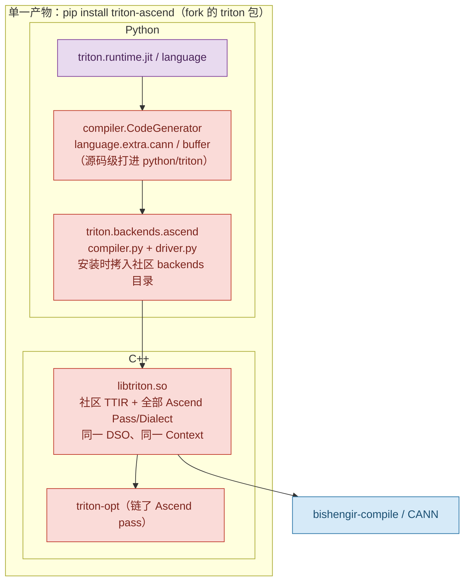
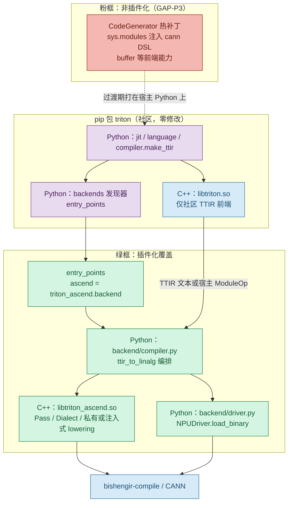
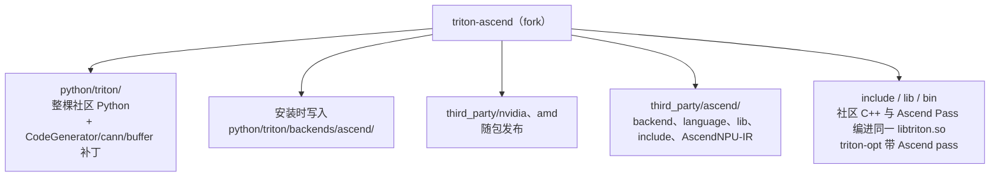
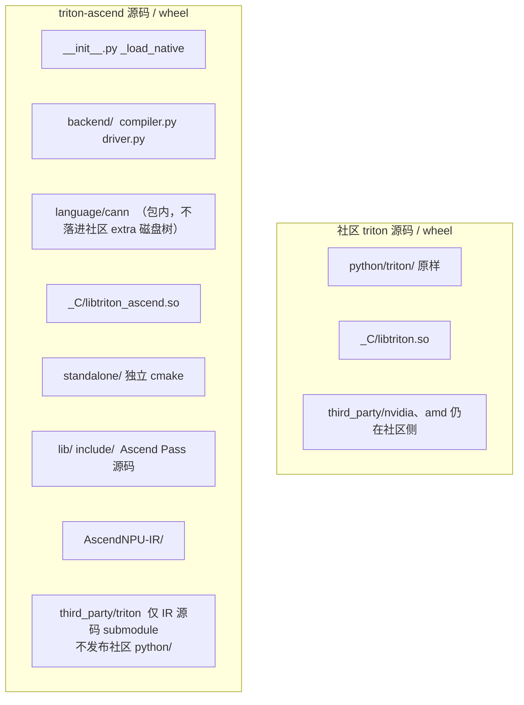
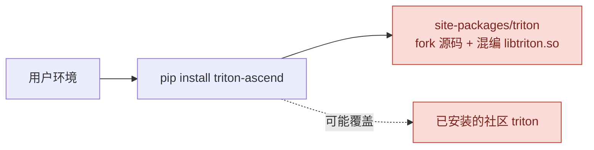
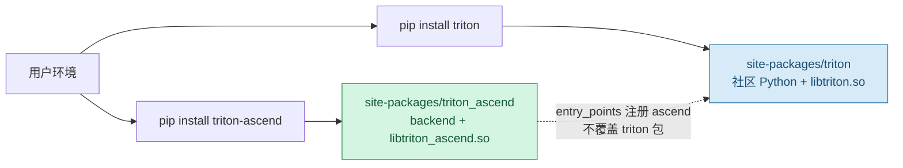
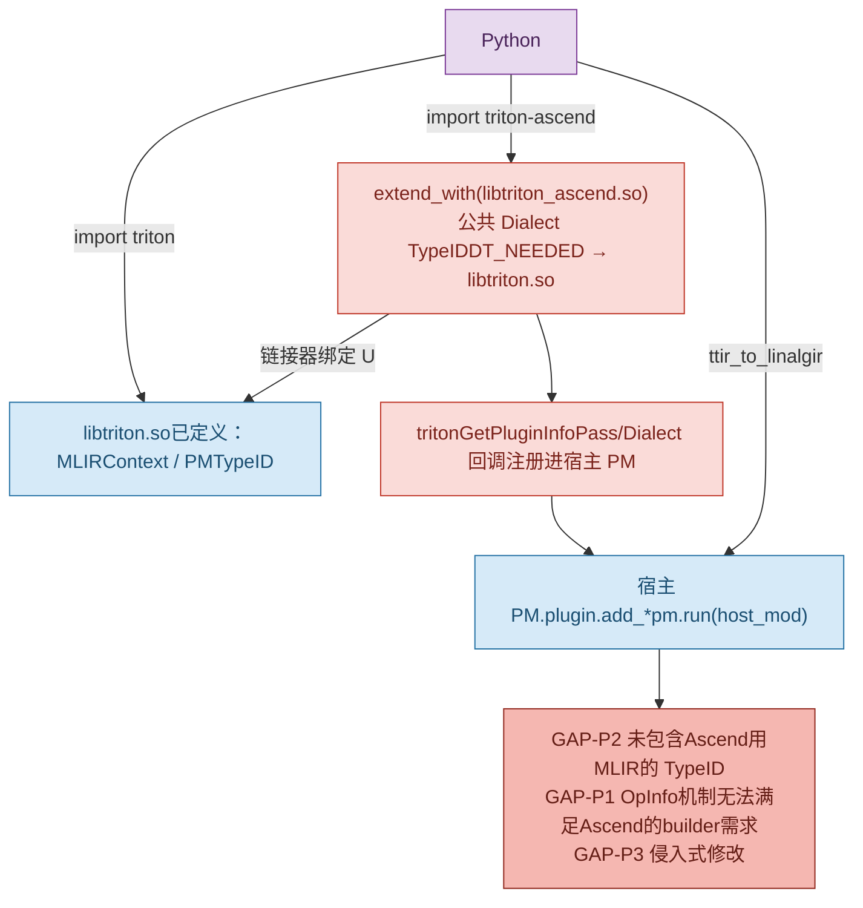
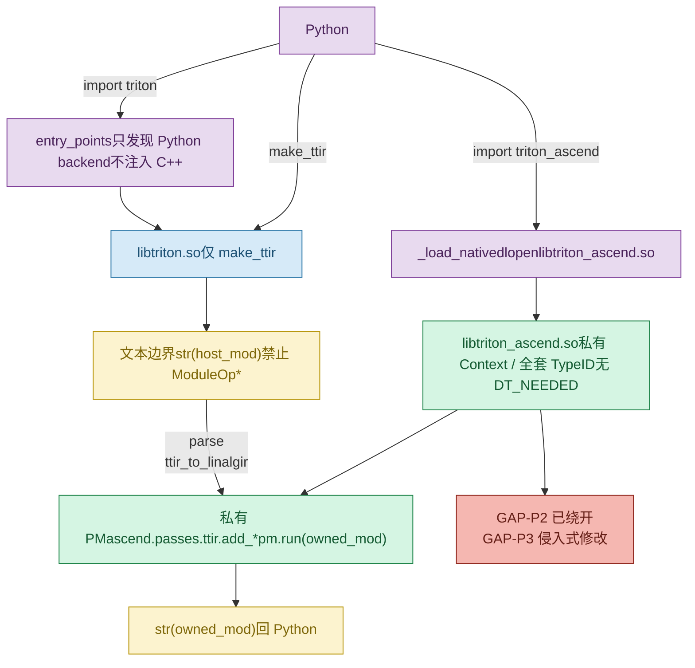

# 1 插件化机制与产品形态

无论后续走方案一（社区 Plugin 同 Context）还是方案二（Ascend 私有 Context），**产品级架构、源码目录切分、用户部署形态是同一套目标**。两套方案只差 C++ lowering 如何挂到社区 Triton 上，不改变「社区 triton 包 + 独立 triton-ascend 包」这条产品线。

## 1.1 什么是插件化

这里的「插件化」指：昇腾后端以**独立 pip 包**接入**未修改的社区 Triton**，而不是把 Ascend 源码、补丁、NVIDIA/AMD 后端和社区 `python/triton` 打进同一个 fork wheel。

接入分两层，不要混为一谈：

| 层次 | 社区提供的机制 | 作用 |
| --- | --- | --- |
| Python 后端发现 | `entry_points["triton.backends"]` | `import triton` 时找到 `AscendBackend` / `NPUDriver`，决定走哪套 **Python compiler.py** |
| C++/MLIR 编译栈 | `tritonGetPluginInfo` / `extend_with`（方案一）；或自有 nanobind so（方案二） | 把 Ascend Pass / Dialect / 部分 Op **接到 lowering** |

插件化解决的是 **「Ascend 作为 out-of-tree 后端被发现、被编译、被加载」**，不是「任意改社区前端语法」。

## 1.2 插件化能做什么、不能做什么

**能做（插件化覆盖，下图绿框）**

- Python：用 `entry_points` 注册独立 `backend/compiler.py`、`driver.py`，编排 TTIR→Linalg、调 CANN 加载 npubin
- C++：Ascend Pass、HIVM/HACC/Annotation 等 Dialect、私有或注入式 lowering so（`libtriton_ascend.so`）
- 部署：社区 `libtriton.so` 与 Ascend so 分属两个 wheel，互不覆盖

**不能做（不属于插件化范畴，下图粉框）**

社区既没有 Python 前端插件 ABI，PluginUtils 也只覆盖宿主 MLIR 的 Pass/Dialect/Op。下列能力 **不能** 靠 `extend_with` 或 `entry_points` 装进去：

- 改 `@triton.jit` / `CodeGenerator` / AST→TTIR
- 往社区 `triton.language`、`language.extra`、buffer 语言里加 DSL
- 改社区 `libtriton.so` 的符号导出、TypeID、头文件

这类问题只能：**迁进 triton-ascend 包内实现**、**过渡期 monkeypatch**、或 **贡献上游**。这是 GAP-P3，不是插件 ABI 再扩一点就能消掉的。

## 1.3 产品架构图（现状 vs 目标）

颜色：紫 = Python；蓝 = 社区 C++；绿 = 插件化覆盖的昇腾能力；粉 = 非插件化（热补丁 / 迁包 / 上游）。

**现状：fork 一体（插件化前）**

Ascend Python/C++ 全部编进同一份 `triton-ascend` fork；社区 `triton` 包被替换或覆盖，无独立插件边界。



**目标：双包（插件化后，方案一/二共用）**

绿框 = 插件化能独立交付的部分；粉框 = 仍须迁包 / monkeypatch / 上游，两套方案都在。



组件对照：

| 层 | 组件 | 插件化前（fork） | 插件化后（双包） | 是否插件化覆盖 |
| --- | --- | --- | --- | --- |
| Python 社区 | `jit` / `language` / `make_ttir` | fork 内可能带补丁 | 社区原样 | 否，必须保持社区包 |
| Python 社区 | `CodeGenerator`、cann/buffer DSL | 直接改 `python/triton` | 迁包或 monkeypatch 或上游 | **否** |
| Python 昇腾 | `compiler.py` / `driver.py` | 拷进 `triton.backends.ascend` | `triton_ascend.backend` + entry_points | **是** |
| C++ 社区 | `libtriton.so` | 混编 Ascend | 仅 TTIR 前端 | 否 |
| C++ 昇腾 | Pass / HIVM 等 | 链进同一 `libtriton.so` | `libtriton_ascend.so` | **是** |
| 工具链 | `bishengir-compile` | 外部 CANN | 同左 | 产品依赖，非 Triton 插件 ABI |

方案一/二只改变绿框里 C++ 与蓝框的连接方式（`extend_with` 注入宿主 PM，或 `str(mod)` + 私有 PM），不改变本图的包边界。

## 1.4 目录图（插件化前后）

**插件化前：一份 fork 仓库，社区源码与昇腾源码缠在一起**



**插件化后：社区仓库不动；昇腾独立仓库/独立 wheel（方案一/二目录相同）**



安装后 site-packages 对应关系：`triton/` 只有社区文件；`triton_ascend/` 只有昇腾 backend / language / `_C/*.so`。不再把 ascend 拷进 `triton/backends/`。

## 1.5 部署图（产品部署态）

**插件化前**

`pip install triton-ascend` 实际装的是 **改名发布的 fork Triton**（`TRITON_WHEEL_NAME=triton_ascend`，包内仍是 `python/triton`）。与已安装的社区 `triton` 抢同一套模块路径，存在**覆盖、版本错位、GPU 用户环境被 NPU fork 替换**的风险。用户无法「先装官方 Triton，再加一块昇腾后端」。



**插件化后**

两个官方语义的包并存：社区 Triton 保持可独立用于 GPU/CPU；`triton-ascend` 只追加 NPU backend。`import triton` 不改社区代码；`entry_points` 发现昇腾；`import triton_ascend` 加载 `libtriton_ascend.so`。



| | 插件化前 | 插件化后 |
| --- | --- | --- |
| 安装命令 | `pip install triton-ascend` | `pip install triton` 再 `pip install triton-ascend` |
| 社区包 | 被 fork wheel 替换或覆盖 | 原样保留，可单独升级 |
| 昇腾包 | 与社区源码打成一个 wheel | 独立 wheel，只含 Ascend |
| 对 GPU 用户 | 装 NPU 包可能毁掉社区 Triton | 互不影响 |

---

# 2 项目目标形态

## 2.1 轻量化双包部署

实现社区原生 Triton 与昇腾后端完全解耦，支持独立安装、即插即用：

```bash
pip install triton          # 社区nightly/release包，无Ascend C++代码
pip install triton-ascend   # ascend backend + libtriton_ascend.so
```
## 2.2 核心运行链路

```python
import triton                 # entry_points 发现 ascend backend（仅 Python 入口）
import triton_ascend          # 加载 dlopen libtriton_ascend.so
@triton.jit
def kernel(...): ...          # 路由至ascend backend，接管全程编译优化流程
```
## 2.3 穿刺验收锚点

社区 nightly triton + 独立 triton-ascend 包，成功执行`unittest/pytest_ut/test_add.py`。

# 3 穿刺方案对比分析

产品级架构 / 目录 / 部署已在 **§1** 给出，两套方案共用。本章只对比 **C++ lowering 如何接到社区 Triton**（同 Context 注入 vs 私有 Context）。

两套方案产物均为 `libtriton.so + libtriton_ascend.so`，核心差异不在于动态库数量，而在于**MLIR Context 隔离策略、TypeID 符号解析规则、跨 DSO 数据传递方式**，本质是「宿主共享架构」与「私有独立架构」。

**核心底层约束**：MLIR 机制限制，同一进程内同一个 Dialect 的 TypeID 仅允许存在唯一实例。

| 对比维度         | 方案一：社区 Plugin 同 Context 方案                                                                                                                | 方案二：Ascend 独立编译栈私有 Context 方案                                                                                                               |
| ------------ | ----------------------------------------------------------------------------------------------------------------------------------------- | ------------------------------------------------------------------------------------------------------------------------------------------- |
| MLIR Context | **单全局 Context**，插件Pass/Dialect全部注册注入宿主Triton Context                                                                                      | **双独立 Context**：宿主仅负责 TTIR 前端；Ascend 私有 Context 完成 lowering 流程                                                                              |
| ModuleOp 传递  | 直接传递C对象指针`ModuleOp*`，在宿主PassManager执行编译。示例：`passes.plugin.extend_with(so)`<br>`passes.plugin.add_triton_to_linalg(pm, args)``pm.run(mod)` | 跨 DSO **只传 MLIR 文本**；通过私有 PassManager执行编译，示例：<br>`pm = ascend.ir.pass_manager(ctx)`<br>`ascend.passes.ttir.add_triton_control_flow_opt(pm)` |
| TypeID符号规则   | 共享宿主TypeID命名空间，Ascend插件侧公共Dialect符号标记为未定义，运行时依赖宿主导出符号解析                                                                                   | 独立私有TypeID命名空间，全套MLIR/TritonIR TypeID内置在Ascend动态库，不依赖宿主解析                                                                                   |
| Ascend 插件内容  | Ascend自研业务代码（Pass、HIVM）在插件库，公共MLIR能力依赖宿主库                                                                                                 | Ascend自研代码公共MLIR/TritonIR能力全部内置插件库，完全自包含                                                                                                    |
| 社区能力依赖       | 强依赖社区Plugin机制API：<br>`extend_with` / `extend_dialects_with` / `builder.extend_with`                                                       | 仅依赖Python层`entry_points`后端发现API，不向宿主注入任何C++层能力                                                                                              |
| ELF依赖关系      | 配置`DT_NEEDED: libtriton.so`，C++层基于ABI强依赖宿主库                                                                                               | 无宿主库依赖，C++层ABI完全独立，无`DT_NEEDED`绑定                                                                                                           |
| 动态库体量        | 体积更小，复用宿主公共MLIR能力                                                                                                                         | 体积更大，MLIR / TritonIR 实现内置到 Ascend 插件库                                                                                                       |
| 核心技术卡点       | GAP-P1：OpInfo ABI不匹配Ascend Builder；<br>GAP-P2：社区宿主库未导出所需TypeID符号；<br>GAP-P3：存在宿主侵入式修改补丁                                                   | GAP-P2完全绕开；<br>GAP-P3：存在宿主侵入式修改补丁                                                                                                           |
>TypeID命名空间：绑定MLIRContext的运行期Op/Type ID注册表，同一命名空间内TypeID不可重复。
## 3.1 架构与符号解析流程图

### 方案一：同 Context、共享 TypeID命名空间、社区 Plugin



### 方案二：分 Context、私有 TypeID命名空间、独立编译栈（当前主路径）



## 3.2 符号链路对照说明

|阶段|方案一|方案二|
|---|---|---|
|Python后端发现|依托`entry_points`机制完成后端注册发现API调用|依托`entry_points`机制完成后端注册发现API调用|
|C库加载方式|依赖社区专属插件API：`passes.plugin.extend_with(so)`系列接口加载，绑定社区插件ABI规范|通过原生`_load_native`+importlib机制独立加载，不依赖社区插件API与ABI|
|TypeID符号解析|插件侧符号未定义，依赖动态链接器从`libtriton.so`宿主库解析绑定，共享宿主TypeID命名空间|TypeID符号在Ascend动态库内部完整定义，拥有独立TypeID命名空间，无需向宿主库解析依赖|
|前端 TTIR生成|宿主Context生成TTIR并持有原生IR对象，全程共享宿主编译环境与TypeID命名空间|宿主仅生成TTIR文本数据，不参与、不持有后续编译IR对象，与昇腾私有编译环境完全隔离|
|IR Lowering执行|Ascend自定义Pass挂载至宿主PM，共享宿主IR对象与TypeID命名空间完成编译，遵循社区插件ABI约束|文本反序列化生成私有IR对象，通过私有PM独立执行编译流水线，适配自研ABI规范|
|结果回传|直接复用宿主IR对象，无数据转换开销，依托宿主ABI完成对象传递|私有编译结果序列化为文本回传Python层，交由`bishengir-compile`后续处理，规避跨DSO ABI兼容问题|

# 4 方案一：基于社区 Triton Plugin 机制

基于社区标准插件ABI开发，完成Pass、Dialect插件化适配，但受限于社区接口能力与符号导出约束，目前正式双包目标态无法穿刺成功，仅沉淀工程经验。

## 4.1 社区 Plugin 能力说明

Triton 3.7 社区提供一套**C++层MLIR标准化插件ABI**，核心入口定义于`triton/Tools/PluginUtils.h`，固定导出入口函数 `tritonGetPluginInfo()`。插件通过该入口注册三类能力，实现**向宿主原生C++/MLIR编译栈注入自定义编译逻辑**。

>**注意：该机制属于MLIR编译层插件扩展**，与Python层能力完全隔离。
>1. 不属于 Python 前端可插拔能力，不修改前端语法与调度逻辑；
>2. 与 `triton.backends` 体系的 Python 后端包发现机制**完全独立**，两套机制互不干涉；
>3. 仅用于扩展宿主MLIR编译栈的 Pass、Dialect、自定义Op能力，运行时深度绑定宿主Context、TypeID命名空间与编译流水线。

社区插件通过三张核心注册表，完成能力注册与注入：

|注册表|回调函数|宿主加载后能力|
|---|---|---|
|PassInfo|`void (*)(PassManager*, const vector<string>&)`|Python 侧`passes.plugin.add_<name>(pm, args)`注册 Pass，遵循社区插件ABI规范|
|DialectInfo|`void (*)(DialectRegistry*)`|`ir.extend_dialects_with`，将 Dialect 注册进宿主 Registry，共享宿主TypeID命名空间|
|OpInfo|`void (*)(TritonOpBuilder&, vector<Value>&)`|`ir.builder.extend_with`，在 builder 上注册自定义 Op，受固定ABI约束|

Python 侧宿主加载 API（注：triton 主线版本能力）：

```python
passes.plugin.extend_with(so)      # dlopen插件，注册Pass回调
ir.extend_dialects_with(so)        # 向宿主DialectRegistry注入自定义Dialect
ir.builder.extend_with(so)         # 基于OpInfo注册builder自定义Op
```

### Triton 版本能力矩阵

|维度|main nightly(f893845b)|PyPI 3.7.1|PyPI3.8.0|说明|
|---|---|---|---|---|
|插件注册 API|支持`extend_with`三件套|仅支持环境变量`TRITON_PLUGIN_PATHS`进行加载|同 3.7.1|正式 Release 包无 Python 自动注册 API|
|wheel 内置头文件`triton/include/`|✅|❌|❌|编译 out-of-tree 插件依赖该头文件；加载插件不依赖|
|Out-of-tree 插件开发|✅|❌|❌|Release 包缺少头文件 + 缺少 extend_with 接口，无法编译插件|

核心约束：`triton/include/`是编译插件的依赖头文件，仅用于构建阶段；插件运行加载不需要。PyPI 发布包缺失头文件，无法直接编译社区规范插件，如果在3.7/3.8做插件化需要拉取社区代码的头文件进行编译(submodule)。

## 4.2 模块适配改造

### 4.2.1 Pass 模块适配

#### 社区插件接口约束
1. C回调(`AddPassCallback = void (*)(PassManager*, const vector<string>& args)`)入参仅支持字符串键值对数组，不支持C++结构体、布尔、数值等原生强类型参数，属于固化的ABI约束；
2. Python侧通过固定API `add_<pass_name>(pm, args=["k=v",...])`调用。

#### 原生适配问题
Ascend原有Pass创建接口为强类型参数（bool/string/自定义Options结构体），与社区插件ABI不兼容，无法直接注册使用。

#### 改造方案
1. 封装适配层回调：解析社区字符串参数，转换为Ascend原生强类型配置与Options结构体，适配社区ABI规范；
2. 注册至PassInfo表，自动生成社区规范Python调用API；
3. 编译层统一参数序列化逻辑，对齐原有业务配置。

#### 核心伪代码

```c++
// 社区规范Pass注册回调（适配字符串参数ABI）
void addTritonToLinalg(PassManager *pm, const vector<string> &args) {
  bool namedOps = parseBool(args, "named_ops", false);
  bool compileOn91095 = parseBool(args, "compile_on_910_95", false);
  string compileMode = parseString(args, "compile_mode", "simd_simt_template");
  pm->addPass(createTritonToLinalgPass(namedOps, compileOn91095, compileMode));
}
PluginInfo *tritonGetPluginInfo() {
  static PassInfo passes[] = {
    {"triton_to_linalg", "0.1.0", addTritonToLinalg, registerTritonToLinalg},
  };
  // ...填充PluginInfo元信息
}
```

```python
# compiler.py 调用逻辑
passes.plugin.extend_with(so)
passes.plugin.add_triton_to_linalg(
    pm, ["named_ops=true", "compile_on_910_95=false", "compile_mode=simd_simt_template"])
pm.run(mod)
```

### 4.2.2 Dialect 模块适配（可注册，受 TypeID 约束）

社区Dialect插件注册回调原型：

```c++
using RegisterDialectCallback = void (*)(DialectRegistry *);
struct DialectInfo { const char *name; const char *version; RegisterDialectCallback registerDialect; };
```

宿主调用 `ir.extend_dialects_with(so)` 时，触发回调将自定义Dialect插入宿主全局Registry，共享宿主TypeID命名空间。改造后将Ascend静态注册逻辑迁移为插件回调：

```c++
void registerAscendNpuIrDialects(DialectRegistry *registry) {
  registry->insert<annotation::AnnotationDialect,
                   hivm::HIVMDialect, scope::ScopeDialect>();
}
```

**关键限制**：该逻辑仅完成「注册动作」，Dialect核心实现与TypeID定义必须与当前Context处于同一DSO，若重复定义TypeID，会直接触发GAP-P2符号冲突与断言崩溃，本质是共享TypeID命名空间的强约束导致。

### 4.2.3 Builder & OpInfo 模块（GAP-P1）

社区OpInfo存在固定ABI约束，能力边界严格受限：

```c++
using AddOpCallback = void (*)(TritonOpBuilder &, std::vector<mlir::Value> &);
struct OpInfo {
  const char *name;
  AddOpCallback addOp;
};
```

对应Python调用API仅支持：`create_<name>(operands: list[Value]) -> Value`，**仅支持Value输入输出，不支持Attribute、字符串、字典、多返回值**，属于底层ABI能力缺失。

#### Ascend 现有 Builder 能力适配对照

|接口方法|特征|能否适配 OpInfo|
|---|---|---|
|`parse_attr(value: str) -> Attribute`|字符串输入，输出 Attribute，无 Value|❌|
|`create_custom_op(name: str, attrs: dict, ins, outs, arg_attrs: list[dict])`|依赖字符串、字典属性、多输入多输出|❌|
|`create_extract_scalar(src, indices: list[Value]) -> Value`|仅 Value 输入，单返回值|✅（仅少量简单接口）|

#### 可选改造路径评估

- 路径 A：全部 Attr 编码为 Value 常量：需要自研序列化协议，无法支持动态自定义字典属性，仅覆盖少量简单 Op，支撑 Ascend 全量 IR 改造工程量大；
- 路径 B：上游修改 Plugin ABI：需要修改社区 PluginUtils.h，改动官方API版本，侵入社区源码；
- 路径 C：放弃 OpInfo 主路径，继续使用 nanobind `.def`绑定，独立维护一套AscendNPUIROpBuilder。

> 结论 **GAP-P1**：社区 OpInfo 的 ABI 能力无法覆盖 Ascend IR 构造全量需求；Pass 通道可通过适配兼容，Op 通道受底层ABI限制无法满足业务需求。
## 4.3 核心卡点 GAP 分析

### GAP-P1：OpInfo ABI 能力不匹配 Ascend Builder

社区 OpInfo 底层ABI模型仅支持 Value 进出，无法支撑昇腾IR构造依赖的属性解析、自定义参数、多返回值等核心能力，现有社区API无法通过上层适配补齐该底层ABI缺陷。
### GAP-P2：TypeID 符号导出问题（阻塞 nightly 双包主路径）

公共 MLIR Dialect 的 TypeID 定义在宿主`libtriton.so`，`libtriton_ascend.so`侧标记为未定义符号，依赖动态链接器在宿主库中解析绑定，共享宿主TypeID命名空间。
1. 社区 nightly wheel**没有导出 Linalg/Tensor 等 TypeIDResolver 符号**；加载`libtriton_ascend.so`时报 undefined symbol，统计缺失 TypeID 相关符号约 106 个，总未定义符号 242 个，属于宿主库ABI导出缺失问题；
2. 若`libtriton_ascend.so`内置公共 MLIR Dialect TypeID，同一宿主Context、同一TypeID命名空间下会出现双份TypeID，直接触发 MLIR 断言崩溃；
### GAP-P3：侵入式修改需要消减

双包无侵入目标要求社区源码零修改，但当前部分编译逻辑依赖宿主 Python 层补丁，无法通过标准插件 ABI 消解，需全部迁移至 triton-ascend 包内实现、过渡期 monkeypatch，或贡献上游。能力边界见 **§1.2**（粉框，不属于插件化范畴）。
>注：具体清单在侵入式消减表格呈现，本文不详细展开。

# 5 方案二：Ascend 独立编译栈（私有 Context）

>依旧输出`libtriton_ascend.so`，但定位变更：内置完整 MLIR、私有 MLIRContext，**不再**向宿主注入插件 Pass/Dialect。宿主仅负责社区 TTIR 前端，彻底隔离双方ABI与TypeID命名空间。

## 5.1 核心架构设计

整体拆分为「社区前端 + 昇腾私有编译后端」两层解耦架构，实现API、ABI、TypeID命名空间全维度隔离：
1. **社区Triton层（纯前端）**：仅负责内核语法解析、标准化TTIR生成，执行社区原生 `make_ttir` 流程（inline/combine/unroll）。生成IR后序列化为纯文本，**不传递任何C++对象指针**至插件层，规避跨DSO ABI兼容问题。
2. **插件加载层（独立接入）**：Python 通过`entry_points`发现 backend API；通过`_load_native`独立 dlopen`libtriton_ascend.so`，不调用社区`extend_with`系列插件API，无任何社区ABI绑定依赖。
3. **昇腾编译层（私有闭环）**：动态库内部内置独立 MLIRContext、全套MLIR/TritonIR TypeID、自研Pass流水线、昇腾自定义Dialect，拥有完全独立的TypeID命名空间。通过解析TTIR文本生成私有IR对象，在私有PassManager中完成完整Lowering编译，最终序列化文本回传Python。

### 加载层伪代码（对比方案一的 extend_with）

```python
# setup.py：只注册 Python 编译器入口，不装 C++ Plugin
entry_points={"triton.backends": ["ascend = triton_ascend.backend"]}
# triton_ascend/__init__.py：按路径加载 so，导出 ir / passes
spec = importlib.util.spec_from_file_location(
    "triton_ascend._C.libtriton_ascend", "triton_ascend/_C/libtriton_ascend.so")
native = importlib.util.module_from_spec(spec)
spec.loader.exec_module(native)          # 等价 dlopen，无 DT_NEEDED: libtriton.so
ir, passes = native.ir, native.passes    # 不调用 passes.plugin.extend_with，无社区ABI依赖
```

## 5.2 关键模块实现细节

### 5.2.1 Pass编译流水线

不走社区 PassInfo 字符串ABI约束。通过nanobind将`createXxxPass(bool, string, ...)`强类型接口直接绑定为`ascend.passes.ttir.add_*` Python API，保留原生强类型参数能力。Pass 执行顺序仍由 Python`ttir_to_linalg`统一编排。

#### C++ 绑定伪代码

```c++
// 方案一：PassInfo 回调，参数只能是 vector<string>（社区ABI强约束）
// void addTritonToLinalg(PassManager *pm, const vector<string> &args);
// 方案二：创建的 Pass 挂载至私有PM，使用自研ABI、支持强类型参数
m.def("add_triton_to_linalg",
      [](OwnedPassManager &pm, bool namedOps, bool compileOn91095,
         const std::string &compileMode) {
        pm.pm.addPass(createTritonToLinalgPass(
            /*globalKernel=*/false, namedOps, /*nd2nz=*/false,
            /*selectAnalysis=*/true, compileOn91095, compileMode));
      });
```

#### Python 编排伪代码

```python
# 方案一：pm / mod 都来自 libtriton.so，共享宿主ABI与TypeID命名空间
passes.plugin.extend_with(so)
passes.plugin.add_triton_to_linalg(pm, ["named_ops=true", ...])
pm.run(mod)

# 方案二：宿主只提供 TTIR 文本，lowering 在私有Context、私有ABI环境执行
ttir_code = str(mod)                     # 跨 DSO 边界，禁止传 ModuleOp*，规避ABI不兼容问题
ctx = ascend.ir.context()
owned_mod = ascend.ir.parse(ttir_code, ctx)
pm = ascend.ir.pass_manager(ctx)
ascend.passes.ttir.add_triton_control_flow_opt(pm)
ascend.passes.ttir.add_triton_to_structure(pm, False, False)
ascend.passes.ttir.add_discrete_mask_access_conversion(pm, compile_on_910_95, compile_mode)
ascend.passes.ttir.add_triton_to_annotation(pm)
ascend.passes.ttir.add_triton_to_unstructure(pm, compile_on_910_95, compile_mode)
ascend.passes.ttir.add_triton_to_hivm(pm)
ascend.passes.ttir.add_triton_to_hfusion(pm, compile_on_910_95)
ascend.passes.ttir.add_triton_to_llvm(pm)
ascend.passes.ttir.add_bubble_up_operation(pm)
ascend.passes.ttir.add_triton_to_structure(pm, False, False)
ascend.passes.ttir.add_triton_to_linalg(
    pm, False, named_ops, False, enable_select_analysis,
    compile_on_910_95, compile_mode)
pm.run(owned_mod, "ttir_to_linalg")
out = str(owned_mod)                     # 文本回传Python，彻底隔离跨DSO ABI风险
```

### 5.2.2 Dialect与TypeID管理

私有Context初始化时，在动态库内部完成**全量Dialect注册**，包含公共MLIR Dialect、社区TritonIR（通过**submodule**编入）、昇腾自定义HIVM/Annotation/HACC Dialect。所有TypeID均为库内自有定义，拥有独立TypeID命名空间，无需依赖宿主导出符号，**彻底绕开GAP-P2致命卡点**。

#### C++ 伪代码

```c++
// 私有 Context 自主初始化，TypeID命名空间与宿主完全隔离
void loadOwnedContext(MLIRContext &context) {
  DialectRegistry registry;
  registry.insert<func::FuncDialect, linalg::LinalgDialect, tensor::TensorDialect,
                  triton::TritonDialect, // 源码来自 triton（submodule）
                  hivm::HIVMDialect, annotation::AnnotationDialect,
                  hacc::HACCDialect, scope::ScopeDialect>();
  context.appendDialectRegistry(registry);
  context.loadAllAvailableDialects();
}
```

### 5.2.3 Builder算子能力

废弃社区OpInfo插件通道（规避其ABI能力缺陷），基于私有Context构建独立 `ascendnpu_ir_builder`，原生支持Attribute解析、模块自定义属性配置（`hacc.target`、`hacc.grid_num_tiles`），彻底解决社区ABI无法适配昇腾IR构造的问题。当前已完成基础IR构造能力适配，全量CANN自定义算子Builder仍待完善。

#### 伪代码

```python
builder = ascend.ir.ascendnpu_ir_builder(ctx, target_arch, compile_mode)
owned_mod.set_attr("hacc.target",
                   builder.parse_attr(f'#hacc.target<"{target_arch}">'))
```

```c++
// 私有 Context 上独立解析Attribute，无社区ABI依赖
Attribute parse_attr(OwnedBuilder &self, const std::string &value) {
  return mlir::parseAttribute(value, self.builder.getContext());
}
void set_attr(OwnedModule &mod, const std::string &name, OwnedAttribute attr) {
  (*mod.op)->setAttr(name, attr.attr);
}
```

**现状穿刺结论**：nightly 社区 triton + 独立`triton-ascend` wheel 上，`test_add` fp32/fp16 可跑通。int8/uint8 仍存在GAP-P3侵入式修改遗留问题。

## 5.3 核心卡点 GAP 分析

|ID|缺口描述|
|---|---|
|GAP-P3侵入式修改|code_generator、buffer等侵入式修改，需全部迁移至 triton-ascend 包内实现或者贡献上游，具体在侵入式消减表格呈现|
|工程依赖优化|需通过submodule托管Triton源码，完善完整编译依赖，彻底剥离对宿主libtriton.so的所有ABI、符号依赖|
